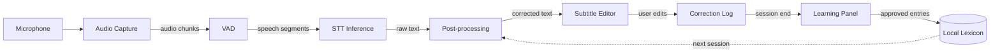
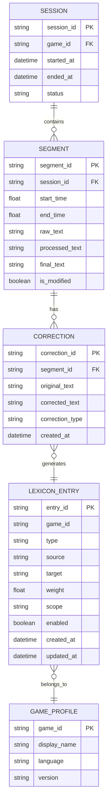

# Luciper — Architecture Overview

> **버전**: 0.1.0-draft
> **최종 수정**: 2026-03-29
> **상태**: 초안 — 리뷰 대기

---

## 1. 제품 정의

Luciper는 **격투 게임 특화 로컬 STT(Speech-to-Text) 도구**다.

음성을 실시간으로 텍스트로 변환하고, 도메인 특화 후처리와 사용자 피드백 루프를 통해 전사 품질을 점진적으로 개선한다. 1차 타겟은 철권(Tekken)이며, 아키텍처는 다른 게임으로의 수평 확장을 전제로 설계한다.

### 이 제품이 풀려는 문제

| # | 문제 | 접근 |
|---|------|------|
| 1 | 범용 STT는 게임 용어를 잘못 인식한다 | 도메인 용어집 기반 후처리로 교정 |
| 2 | 모델 fine-tuning은 비용이 크다 | 모델은 그대로 두고, 후처리 + 용어집 적응 루프로 해결 |
| 3 | 수정 과정이 번거롭다 | 세션 종료 시 일괄 학습 제안, 수정 중 무간섭 |
| 4 | API 의존 제품은 비용과 프라이버시 문제가 있다 | 완전 로컬 추론, 네트워크 불필요 |

### 핵심 차별점

**모델 자체가 아닌, "후처리 파이프라인 + 세션 종료 학습 UX + 용어집 적응 루프"** 가 제품의 핵심이다.

---

## 2. 설계 원칙

| 원칙 | 설명 | 위반 예시 |
|------|------|-----------|
| **로컬 퍼스트** | 네트워크 없이 모든 핵심 기능 동작 | 용어집을 서버에서만 관리 |
| **무간섭 수정** | 자막 수정 중 팝업·추천·알림 금지 | 수정할 때마다 "이걸 학습할까요?" |
| **세션 종료 일괄 학습** | 저장/다운로드 직전에 한 번만 학습 제안 | 실시간으로 용어집 자동 반영 |
| **점진적 정교화** | 빈 용어집에서 시작, 사용할수록 개선 | 초기에 완성된 용어 DB 요구 |
| **확장 가능 구조** | 게임·언어는 프로필 단위로 분리 | 철권 로직이 코드 전역에 하드코딩 |
| **최소 마찰 설치** | 가능한 한 원클릭 설치, 의존성 최소화 | CUDA·Python 수동 설치 요구 |

---

## 3. 시스템 아키텍처

### 3.1 프로세스 구조

```text
┌─────────────────────────────────────────────────────┐
│                    Electron App                      │
│  ┌───────────────────────────────────────────────┐   │
│  │              React UI (Renderer)              │   │
│  │  ┌──────────┐ ┌──────────┐ ┌──────────────┐   │   │
│  │  │ Controls │ │ Subtitle │ │   Learning   │   │   │
│  │  │  Panel   │ │  Editor  │ │    Panel     │   │   │
│  │  └──────────┘ └──────────┘ └──────────────┘   │   │
│  └──────────────────┬────────────────────────────┘   │
│                     │ IPC (Electron IPC)              │
│  ┌──────────────────┴────────────────────────────┐   │
│  │              Main Process (Node.js)            │   │
│  │  ┌──────────────────────────────────────────┐  │   │
│  │  │  Python Sidecar Manager                  │  │   │
│  │  │  - spawn / health check / restart        │  │   │
│  │  │  - stdio JSON-RPC or WebSocket bridge    │  │   │
│  │  └──────────────────────────────────────────┘  │   │
│  └──────────────────┬────────────────────────────┘   │
│                     │ stdio JSON-RPC / WebSocket      │
│  ┌──────────────────┴────────────────────────────┐   │
│  │           Python STT Worker Process            │   │
│  │  ┌────────┐ ┌─────┐ ┌─────────┐ ┌──────────┐  │   │
│  │  │ Audio  │→│ VAD │→│ STT     │→│ Post-    │  │   │
│  │  │Capture │ │     │ │Inference│ │processing│  │   │
│  │  └────────┘ └─────┘ └─────────┘ └──────────┘  │   │
│  │                                    ↕            │   │
│  │                            ┌──────────────┐     │   │
│  │                            │ Local Lexicon│     │   │
│  │                            │  (SQLite)    │     │   │
│  │                            └──────────────┘     │   │
│  └─────────────────────────────────────────────────┘   │
└─────────────────────────────────────────────────────┘
```

### 3.2 레이어 구조

```text
[L1] Audio Capture ──→ 오디오 입력 수집, 청크 생성
      ↓
[L2] STT Runtime ────→ VAD + Whisper 추론, partial/final 생성
      ↓
[L3] Post-processing ─→ 용어집 기반 후처리, 오인식 교정
      ↓
[L4] Subtitle Editor ─→ 사용자 검수/수정 UI
      ↓
[L5] Lexicon Learning ─→ 수정 기록 분석, 세션 종료 시 학습 제안
      ↓
[L6] Shared Sync ────→ 공유 용어집 동기화 (V2 scope — MVP 제외)
```

> **MVP 범위**: L1 ~ L5. L6은 V2에서 도입한다.

### 3.3 데이터 흐름



---

## 4. 레이어 요약 및 하위 문서

각 레이어의 상세 설계는 별도 문서에 기술한다.

| 레이어 | 책임 | 상세 문서 | 상태 |
|--------|------|-----------|------|
| L1 Audio Capture | 마이크 입력 수집, 오디오 청크 생성 | [01-audio-capture.md](./01-audio-capture.md) | ✅ |
| L2 STT Runtime | VAD + Whisper 추론, partial/final 자막 생성 | [02-stt-runtime.md](./02-stt-runtime.md) | ✅ |
| L3 Post-processing | 용어집 기반 후처리, 오인식 교정, 표기 통일 | [03-post-processing.md](./03-post-processing.md) | ✅ |
| L4 Subtitle Editor | 자막 리스트 편집 UI, 수정 기록 저장 | [04-subtitle-editor.md](./04-subtitle-editor.md) | ✅ |
| L5 Lexicon Learning | 수정 기록 분석, 세션 종료 학습 제안, 로컬 용어집 갱신 | [05-lexicon-learning.md](./05-lexicon-learning.md) | ✅ |
| L6 Shared Sync | 공유 용어집 동기화 (V2) | V2 scope (shared-sync.md) | V2 |

---

## 5. 기술 스택

### 5.1 MVP 스택 (V1)

| 영역 | 선택 | 근거 |
|------|------|------|
| **Desktop Shell** | Electron + React | Tauri는 Rust↔Python IPC 복잡도가 MVP에 과도. Electron은 Node.js child_process로 Python sidecar 관리가 검증된 패턴 |
| **UI Framework** | React + TypeScript | 컴포넌트 생태계, 타입 안전성 |
| **STT Engine** | faster-whisper (CTranslate2) | 로컬 추론 최적화, GPU/CPU 모두 지원, VAD 내장 |
| **오디오 캡처** | sounddevice (PortAudio) | 크로스플랫폼, 마이크 직접 캡처 |
| **후처리** | Python (정규식 + 용어집 lookup) | 규칙 기반, 외부 의존성 없음 |
| **로컬 DB** | SQLite | 로컬 용어집, 수정 로그, 세션 관리 |
| **IPC** | stdio JSON-RPC | Electron Main ↔ Python sidecar 간 통신. WebSocket보다 프로세스 관리가 단순 |
| **패키징** | electron-builder | Windows installer 생성, Python runtime 번들링 |

### 5.2 대안 평가

| 대안 | 장점 | 기각 사유 |
|------|------|-----------|
| Tauri + React | 바이너리 크기 작음, 성능 우수 | Rust↔Python IPC 비자명, sidecar 관리 미성숙 |
| 순수 Web UI (localhost) | 개발 속도 최고 | 사용자가 터미널에서 서버 실행해야 함, 배포 마찰 |
| whisper.cpp | C++ 네이티브, 빠름 | Python 생태계(후처리, 용어집)와 분리됨, 통합 비용 |

### 5.3 Python 번들링 전략

| 방식 | 설명 |
|------|------|
| **embedded Python** | electron-builder에 Python 3.11 + venv를 함께 패키징. 사용자 시스템 Python과 독립 |
| **모델 다운로드** | 첫 실행 시 Whisper 모델을 `~/.luciper/models/`에 다운로드. 앱 번들에 포함하지 않음 (용량 문제) |
| **GPU 감지** | 런타임에 CUDA 가용 여부를 체크하고, 없으면 CPU 모드로 fallback + 사용자에게 안내 |

---

## 6. 하드웨어 요구사양

### 6.1 최소 사양 (CPU 모드, `tiny` 모델)

| 항목 | 사양 |
|------|------|
| OS | Windows 10 64-bit |
| CPU | 4코어 이상 (Intel i5-8세대 / AMD Ryzen 5 2600 급) |
| RAM | 8GB |
| 저장공간 | 2GB (앱 + 모델) |
| GPU | 불필요 |
| 네트워크 | 첫 실행 시 모델 다운로드용 (이후 불필요) |

### 6.2 권장 사양 (GPU 모드, `small` 모델)

| 항목 | 사양 |
|------|------|
| OS | Windows 10/11 64-bit |
| CPU | 6코어 이상 |
| RAM | 16GB |
| GPU | NVIDIA GTX 1060 6GB 이상 (CUDA 11.x+) |
| VRAM | 4GB 이상 |
| 저장공간 | 4GB |

### 6.3 모델별 성능 기대치

| 모델 | 크기 | VRAM 요구 | GPU 지연 (30초 오디오) | CPU 지연 (30초 오디오) | 정확도 (상대적) |
|------|------|-----------|----------------------|----------------------|----------------|
| `tiny` | 75MB | ~1GB | ~1초 | ~5초 | ★★☆☆☆ |
| `base` | 145MB | ~1GB | ~1.5초 | ~10초 | ★★★☆☆ |
| `small` | 488MB | ~2GB | ~2초 | ~25초 | ★★★★☆ |
| `medium` | 1.5GB | ~4GB | ~5초 | ~60초+ | ★★★★★ |

> **MVP 기본값**: GPU 있으면 `small`, CPU만이면 `base`. 사용자가 설정에서 변경 가능.
>
> `medium` 이상은 CPU 모드에서 실시간 전사가 불가능하므로, CPU 환경에서는 선택지에서 비활성화하고 경고를 표시한다.

---

## 7. 게임 프로필 구조 (확장 대비)

다중 게임 확장을 위해, **게임 특화 로직은 프로필 단위로 분리**한다.

### 7.1 프로필 구성

```text
profiles/
├── tekken/
│   ├── profile.json          # 메타데이터 (game_id, display_name, language)
│   ├── lexicon_defaults.json # 기본 제공 용어집
│   ├── rules.json            # 후처리 규칙 (정규식, alias 매핑)
│   └── ui_presets.json       # UI 설정 (표시 형식, 단축키)
├── street-fighter/           # V3+
│   └── ...
└── guilty-gear/              # V3+
    └── ...
```

### 7.2 프로필이 결정하는 것

| 항목 | 예시 (Tekken) |
|------|---------------|
| 기본 용어집 | EWGF, CH, ws, df 등 |
| 후처리 규칙 | "일렉" → EWGF, "카운터 히트" → CH |
| Whisper initial_prompt | "철권 격투 게임 해설. EWGF, 풍신권, 스크류..." |
| UI 표시 형식 | 프레임 데이터 표기 규칙 등 |

### 7.3 V1에서의 구현 범위

- `profile.json` + `lexicon_defaults.json` + `rules.json`만 구현
- 게임 선택 UI는 V1에서 불필요 (Tekken 고정)
- 단, 용어집 스키마에 `game_id` 필드를 **초기부터 포함**
- 후처리 규칙은 `rules.json`에서 로드하도록 설계 (코드에 하드코딩 금지)

---

## 8. 데이터 모델 개요

### 8.1 핵심 엔티티



### 8.2 `lexicon_entries.type` 분류

| type | 설명 | 예시 |
|------|------|------|
| `alias` | 동일 개념의 다른 표현 | 일렉 → EWGF |
| `normalization` | 표기 통일 | ewgf → EWGF |
| `misrecognition` | STT 오인식 교정 | 벽강 → 벽꽝 |
| `phrase` | 복합 구문 | "벽꽝 이후" (하나의 단위) |
| `hotword` | Whisper prompt에 포함할 핵심 용어 | EWGF, 풍신권 |

### 8.3 적용 우선순위

```text
1. 사용자 로컬 용어집 (scope = local)
2. 공유 용어집 (scope = shared, V2)
3. 게임 프로필 기본값 (lexicon_defaults.json)
```

사용자 수정이 항상 최우선. 충돌 시 상위 우선순위가 하위를 override한다.

---

## 9. 개발 로드맵

### V1 — 로컬 핵심 루프 (MVP)

> **목표**: "로컬에서 철권 음성을 텍스트로 변환 + 수정 + 학습"이 동작하는 최소 제품

| 항목 | 내용 |
|------|------|
| L1 Audio Capture | 마이크 입력, 청크 생성 |
| L2 STT Runtime | faster-whisper 추론, VAD, partial/final 분리 |
| L3 Post-processing | 정규식 + 용어집 lookup 기반 후처리 |
| L4 Subtitle Editor | **리스트형 편집기** (타임코드 + 인라인 편집) |
| L5 Lexicon Learning | 세션 종료 학습 제안 패널, 로컬 용어집 갱신 |
| 프로필 | Tekken 프로필 1개 (고정) |
| 패키징 | Windows installer (Electron + embedded Python) |

**의도적 제외**: 타임라인 waveform UI, 공유 용어집, 다중 게임 선택 UI

### V1.5 — 안정화 및 품질 개선

| 항목 | 내용 |
|------|------|
| partial/final 안정화 | 확정 지연 알고리즘 튜닝 |
| 추천 품질 | 학습 제안의 precision 개선 |
| 용어집 import/export | JSON 파일 기반 수동 공유 가능 |
| 설정 UI | 모델 크기 변경, 오디오 장치 선택, 프로필 설정 |

### V2 — 공유 용어집

| 항목 | 내용 |
|------|------|
| L6 Shared Sync | 기여 업로드, 중앙 집계, pull 동기화 |
| 서버 인프라 | FastAPI + PostgreSQL + CDN |
| 보안 | OAuth 인증, rate limiting, Sybil 방어, 롤백 |
| 신뢰도 시스템 | Trust Scoring, 다중 사용자 교차 검증 |

### V3 — 수평 확장

| 항목 | 내용 |
|------|------|
| 다중 게임 프로필 | 스트리트 파이터, 길티기어 등 |
| 캐릭터별 용어팩 | 프로필 내 세부 분류 |
| 언어별 용어팩 | 영어, 일본어 지원 |
| 타임라인 편집기 | waveform 표시, 구간 드래그 |
| 방송/해설 프리셋 | 용도별 후처리 규칙 세트 |

---

## 10. IPC 프로토콜 개요

Electron Main Process ↔ Python Sidecar 간 통신은 **stdio JSON-RPC 2.0** 프로토콜을 사용한다.

### 10.1 통신 흐름

```text
Electron Main                       Python Sidecar
     │                                    │
     │──spawn(python worker.py)──────────→│
     │                                    │
     │──{"method":"start_capture",...}────→│
     │←─{"result":"ok"}──────────────────│
     │                                    │
     │←─{"method":"partial","params":..}──│  (server→client notification)
     │←─{"method":"final","params":..}────│
     │                                    │
     │──{"method":"stop_capture",...}─────→│
     │←─{"result":"session_summary":..}───│
     │                                    │
     │──{"method":"shutdown",...}─────────→│
     │                              (exit) │
```

### 10.2 핵심 메서드

| 방향 | 메서드 | 설명 |
|------|--------|------|
| E→P | `initialize` | 모델 로드, 프로필 설정 |
| E→P | `start_capture` | 오디오 캡처 + STT 시작 |
| E→P | `stop_capture` | 캡처 중지, 세션 요약 반환 |
| E→P | `get_suggestions` | 학습 후보 목록 요청 |
| E→P | `apply_learning` | 승인된 항목 로컬 용어집 반영 |
| E→P | `shutdown` | 프로세스 정리 종료 |
| P→E | `partial_result` | 부분 자막 알림 |
| P→E | `final_result` | 확정 자막 알림 |
| P→E | `status_update` | 상태 변경 알림 (모델 로딩 등) |
| P→E | `error` | 에러 알림 |

---

## 11. 하위 문서 작성 순서

이 문서는 최상위 개요다. 이후 아래 순서로 상세 설계 문서를 작성한다.

### V1 범위

| 순서 | 문서 | 핵심 결정 사항 | 상태 |
|------|------|---------------|------|
| 1 | [01-audio-capture.md](./01-audio-capture.md) | 오디오 장치 선택, 청크 크기, 포맷 | ✅ |
| 2 | [02-stt-runtime.md](./02-stt-runtime.md) | VAD 전략, partial/final 확정 알고리즘, 모델 관리 | ✅ |
| 3 | [03-post-processing.md](./03-post-processing.md) | 규칙 엔진 구조, 용어집 lookup 알고리즘, 파이프라인 순서 | ✅ |
| 4 | [04-subtitle-editor.md](./04-subtitle-editor.md) | UI 컴포넌트 구조, 수정 기록 저장, 검색/치환 | ✅ |
| 5 | [05-lexicon-learning.md](./05-lexicon-learning.md) | 수정 분석 알고리즘, 추천 분류, 승인 UX | ✅ |
| 6 | [06-sidecar-manager.md](./06-sidecar-manager.md) | Electron↔Python 프로세스 관리, JSON-RPC, crash 복구 | ✅ |

### V2 scope (미작성)

| 문서 | 핵심 결정 사항 |
|------|---------------|
| shared-sync.md | 공유 용어집 서버 구조, 보안, Trust Scoring |
