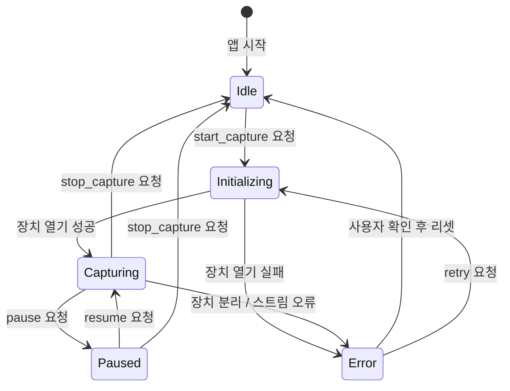

# L1 — Audio Capture Layer

> **상위 문서**: [00-overview.md](./00-overview.md)
> **버전**: 0.1.0-draft
> **상태**: 초안

---

## 1. 책임 정의

Audio Capture Layer는 **마이크로부터 오디오를 수집하고, L2(STT Runtime)가 소비할 수 있는 표준화된 청크를 생성**하는 것이 유일한 책임이다.

### 이 레이어가 하는 것

- 마이크 장치 열거 및 선택
- 선택된 장치에서 연속 오디오 스트림 캡처
- 캡처된 스트림을 고정 크기 청크로 분할
- 입력 레벨 모니터링 (UI 피드백용)
- 장치 연결 해제 / 오류 감지 및 복구

### 이 레이어가 하지 않는 것

- VAD (음성 구간 판별) → L2 책임
- 노이즈 제거 → L2 또는 전처리 모듈 책임
- STT 추론 → L2 책임
- 게임 사운드와 음성 분리 (소스 분리) → 스코프 외

---

## 2. 입력 소스 전략

### 2.1 MVP: 마이크 직접 캡처

| 항목 | 결정 |
|------|------|
| **기본 입력** | 시스템 기본 마이크 |
| **장치 선택** | 사용 가능한 입력 장치 목록 표시, 사용자가 드롭다운으로 선택 |
| **채널** | 모노 (1ch) — Whisper 입력 요구사항 |
| **방식** | sounddevice 콜백 모드 |

**근거**: 격투 게임 해설/음성 해설은 마이크 입력이 주 사용 사례. 게임 사운드가 마이크에 섞이는 문제는 하드웨어(헤드셋) 레벨에서 해결하는 것이 가장 확실하고, 소프트웨어 소스 분리는 복잡도 대비 효과가 낮다.

### 2.2 V1.5+: WASAPI Loopback (선택적)

| 항목 | 설명 |
|------|------|
| **용도** | 녹화된 영상/방송의 시스템 오디오를 직접 캡처 |
| **방식** | Windows WASAPI loopback 모드 |
| **제한** | Windows 전용, 게임 사운드와 음성이 혼합됨 |

WASAPI loopback은 마이크가 아닌 **시스템 출력 오디오 캡처** 용도로만 추가한다. 마이크와 동시 사용(믹싱)은 V1 범위에서 제외한다.

### 2.3 의도적 제외

| 항목 | 사유 |
|------|------|
| OBS / 가상 오디오 장치 연동 | 설정 복잡도가 높고, 일반 사용자 대상 MVP에 부적합 |
| 소스 분리 (source separation) | 연구 수준 기술, 실시간 처리 시 지연 과다 |
| 다중 입력 믹싱 | IPC 및 버퍼 관리 복잡도 과도 |

---

## 3. 오디오 포맷 규격

L1이 출력하는 모든 오디오 데이터는 아래 포맷을 따른다.

| 파라미터 | 값 | 근거 |
|----------|-----|------|
| **샘플링 레이트** | 16,000 Hz | Whisper 모델 입력 요구사항 |
| **비트 심도** | 16-bit signed integer (`int16`) | faster-whisper 기본 입력 포맷 |
| **채널 수** | 1 (모노) | Whisper는 모노만 처리 |
| **엔디언** | Little-endian | x86/x64 표준 |
| **컨테이너** | Raw PCM (무압축) | 실시간 처리, 인코딩 지연 없음 |

> **리샘플링**: 마이크가 16kHz를 직접 지원하지 않는 경우(48kHz 등), sounddevice의 내장 리샘플러를 사용한다. 별도 리샘플링 라이브러리는 도입하지 않는다.

---

## 4. 청크 전략

### 4.1 청크 파라미터

| 파라미터 | 값 | 근거 |
|----------|-----|------|
| **청크 길이** | 30ms | sounddevice 콜백의 기본 블록 크기. UI 레벨 미터 갱신에 충분한 빈도 |
| **버퍼 길이** | 2초 (누적) | L2의 VAD가 소비할 단위. 링 버퍼로 유지 |
| **오버플로 정책** | 가장 오래된 데이터부터 드롭 | STT 지연 시 오디오 손실보다 최신 데이터 유지가 중요 |

### 4.2 버퍼 구조

```text
┌─────────────────────────────────────────────────┐
│            Ring Buffer (2초 = 32,000 samples)    │
│  ┌────┬────┬────┬────┬────┬── ··· ──┬────┐      │
│  │30ms│30ms│30ms│30ms│30ms│  ···    │30ms│      │
│  └────┴────┴────┴────┴────┴── ··· ──┴────┘      │
│     ↑ write_pos                    ↑ read_pos    │
└─────────────────────────────────────────────────┘
        │
        ↓ (L2가 read_pos부터 소비)
   [STT Runtime Layer]
```

### 4.3 L1 → L2 전달 인터페이스

L1은 L2에 직접 데이터를 push하지 않는다. **공유 링 버퍼** 또는 **스레드 안전 큐**를 통해 L2가 자체 속도로 pull한다.

```python
# 인터페이스 계약 (pseudo-code)
class AudioChunk:
    """L1이 생산하고 L2가 소비하는 오디오 청크."""
    samples: np.ndarray     # shape: (n_samples,), dtype: int16
    timestamp: float        # 청크 시작 시각 (세션 시작 기준, 초 단위)
    sample_rate: int        # 항상 16000
    device_id: str          # 캡처 장치 식별자
```

```python
class AudioBuffer(Protocol):
    """L1 → L2 전달 인터페이스."""

    def write(self, chunk: AudioChunk) -> None:
        """L1이 호출. 버퍼가 가득 차면 가장 오래된 데이터를 덮어쓴다."""
        ...

    def read(self, duration_sec: float) -> AudioChunk | None:
        """L2가 호출. 요청 길이만큼의 데이터 반환. 부족하면 None."""
        ...

    def get_level(self) -> float:
        """현재 입력 레벨 (0.0 ~ 1.0). UI 레벨 미터용."""
        ...
```

---

## 5. 장치 관리

### 5.1 장치 열거

```python
def list_audio_devices() -> list[AudioDeviceInfo]:
    """사용 가능한 입력 장치 목록을 반환한다."""
    ...

class AudioDeviceInfo:
    device_id: str          # 고유 식별자
    name: str               # 표시명 (예: "Realtek HD Audio Mic")
    host_api: str           # 호스트 API (예: "MME", "WASAPI")
    max_input_channels: int # 최대 입력 채널 수
    default_sample_rate: float
    is_default: bool        # 시스템 기본 장치 여부
```

### 5.2 장치 선택 로직

```text
1. 앱 시작 시 장치 열거
2. 이전 세션에서 선택한 장치 ID가 저장되어 있으면 해당 장치 사용
3. 저장된 장치가 없거나 연결 해제 상태면 시스템 기본 장치로 fallback
4. 사용자가 설정에서 직접 변경 가능
```

### 5.3 핫플러그 처리

| 이벤트 | 동작 |
|--------|------|
| **사용 중인 장치 분리** | 캡처 중지, UI에 경고 표시, 다른 장치로 자동 전환 시도하지 않음 (사용자 확인 필요) |
| **새 장치 연결** | 장치 목록 갱신, 사용자가 명시적으로 전환해야 적용 |
| **기본 장치 변경** | 현재 캡처 중이면 변경하지 않음 (세션 안정성 우선) |

**근거**: 자동 전환은 세션 중 예기치 않은 오디오 소스 변경을 초래할 수 있다. 사용자 명시적 조작을 요구하는 것이 안전하다.

---

## 6. 상태 머신

Audio Capture는 아래 상태를 갖는다.



### 상태별 동작

| 상태 | 오디오 스트림 | 버퍼 기록 | 레벨 미터 |
|------|-------------|----------|----------|
| `Idle` | 닫힘 | ✗ | ✗ |
| `Initializing` | 열기 시도 중 | ✗ | ✗ |
| `Capturing` | 열림 | ✓ | ✓ |
| `Paused` | 열림 (묵음 삽입) | ✗ | ✗ |
| `Error` | 닫힘 | ✗ | ✗ |

---

## 7. 에러 처리

### 7.1 에러 분류

| 에러 | 심각도 | 복구 전략 |
|------|--------|----------|
| 장치 열기 실패 (권한 없음) | `critical` | 사용자에게 OS 마이크 권한 설정 안내 |
| 장치 열기 실패 (장치 없음) | `critical` | 장치 목록 재탐색, 다른 장치 선택 안내 |
| 리샘플링 실패 | `critical` | 해당 장치의 네이티브 샘플 레이트 지원 불가 안내 |
| 캡처 중 장치 분리 | `error` | 캡처 중지, 장치 재선택 요구 |
| 버퍼 오버플로 | `warning` | 오래된 데이터 드롭, 로그 기록 (사용자에게 알리지 않음) |
| 오디오 글리치 (xrun) | `warning` | 로그 기록, 자동 복구 (사용자에게 알리지 않음) |

### 7.2 에러 보고 경로

```text
L1 에러 발생
  → AudioCapture 내부 로깅 (파일)
  → IPC error notification → Electron Main → Renderer UI
  → UI에 에러 상태 표시 + 복구 액션 버튼
```

`warning` 수준 에러는 로그에만 기록하고, UI에 표시하지 않는다. `error` 이상만 사용자에게 노출한다.

---

## 8. 구현 세부사항

### 8.1 기술 선택: sounddevice

| 기준 | sounddevice | PyAudio |
|------|-------------|---------|
| API 설계 | NumPy 기반, 현대적 | 저수준 C-binding |
| 콜백 모드 | ✓ (PortAudio 콜백 직접 노출) | ✓ |
| 리샘플링 | PortAudio 내장 리샘플러 사용 가능 | 별도 구현 필요 |
| 크로스플랫폼 | Windows / macOS / Linux | 동일 |
| 유지보수 | 활발 | 사실상 중단 |
| **선택** | **✓** | ✗ |

### 8.2 콜백 구조

```python
import sounddevice as sd
import numpy as np
from threading import Event
from queue import Queue

class AudioCapture:
    """L1 Audio Capture — 마이크 입력 수집 및 청크 생성."""

    SAMPLE_RATE = 16_000
    CHANNELS = 1
    DTYPE = "int16"
    BLOCK_SIZE = 480  # 30ms at 16kHz

    def __init__(self, buffer: AudioBuffer, device_id: str | None = None):
        self._buffer = buffer
        self._device_id = device_id
        self._stream: sd.InputStream | None = None
        self._state = CaptureState.IDLE
        self._session_start: float = 0.0

    def _audio_callback(
        self,
        indata: np.ndarray,
        frames: int,
        time_info: dict,
        status: sd.CallbackFlags,
    ) -> None:
        """sounddevice 콜백. 오디오 스레드에서 호출된다."""
        if status.input_overflow:
            logger.warning("Audio input overflow (xrun)")

        if self._state != CaptureState.CAPTURING:
            return

        chunk = AudioChunk(
            samples=indata[:, 0].copy(),  # (frames,) int16
            timestamp=time_info.input - self._session_start,
            sample_rate=self.SAMPLE_RATE,
            device_id=self._device_id or "default",
        )
        self._buffer.write(chunk)

    def start(self) -> None:
        """캡처를 시작한다."""
        if self._state != CaptureState.IDLE:
            raise InvalidStateError(f"Cannot start from state {self._state}")

        self._state = CaptureState.INITIALIZING
        try:
            self._stream = sd.InputStream(
                samplerate=self.SAMPLE_RATE,
                channels=self.CHANNELS,
                dtype=self.DTYPE,
                blocksize=self.BLOCK_SIZE,
                device=self._device_id,
                callback=self._audio_callback,
            )
            self._session_start = time.monotonic()
            self._stream.start()
            self._state = CaptureState.CAPTURING
        except sd.PortAudioError as e:
            self._state = CaptureState.ERROR
            raise DeviceOpenError(str(e)) from e

    def stop(self) -> None:
        """캡처를 중지한다."""
        if self._stream is not None:
            self._stream.stop()
            self._stream.close()
            self._stream = None
        self._state = CaptureState.IDLE
```

### 8.3 레벨 미터 계산

UI에 표시할 입력 레벨은 **가장 최근 청크의 RMS를 0.0~1.0으로 정규화**하여 제공한다.

```python
def _compute_level(self, samples: np.ndarray) -> float:
    """int16 샘플 배열의 RMS 레벨을 0.0~1.0으로 반환한다."""
    rms = np.sqrt(np.mean(samples.astype(np.float32) ** 2))
    normalized = min(rms / 32768.0, 1.0)  # int16 max = 32767
    return float(normalized)
```

레벨 값은 `AudioBuffer.get_level()`을 통해 L2 또는 UI에 전달된다. 이 값은 IPC를 통해 Electron에 주기적으로 보고되며, UI에서 입력 레벨 미터로 시각화한다.

---

## 9. IPC 메서드 (L1 관련)

overview에서 정의한 JSON-RPC 메서드 중 L1이 관여하는 것:

### 9.1 Electron → Python

#### `start_capture`

```json
{
  "jsonrpc": "2.0",
  "id": 1,
  "method": "start_capture",
  "params": {
    "device_id": "hw:0,0",
    "sample_rate": 16000
  }
}
```

```json
{
  "jsonrpc": "2.0",
  "id": 1,
  "result": {
    "status": "capturing",
    "device_name": "Realtek HD Audio Mic",
    "actual_sample_rate": 16000
  }
}
```

#### `stop_capture`

```json
{
  "jsonrpc": "2.0",
  "id": 2,
  "method": "stop_capture"
}
```

```json
{
  "jsonrpc": "2.0",
  "id": 2,
  "result": {
    "status": "idle",
    "duration_sec": 342.5,
    "segments_count": 47
  }
}
```

#### `list_devices`

```json
{
  "jsonrpc": "2.0",
  "id": 3,
  "method": "list_devices"
}
```

```json
{
  "jsonrpc": "2.0",
  "id": 3,
  "result": {
    "devices": [
      {
        "device_id": "hw:0,0",
        "name": "Realtek HD Audio Mic",
        "is_default": true,
        "max_input_channels": 2
      },
      {
        "device_id": "hw:1,0",
        "name": "USB Headset Mic",
        "is_default": false,
        "max_input_channels": 1
      }
    ]
  }
}
```

### 9.2 Python → Electron

#### `audio_level` (주기적 알림)

```json
{
  "jsonrpc": "2.0",
  "method": "audio_level",
  "params": {
    "level": 0.42,
    "is_clipping": false
  }
}
```

> 전송 주기: **100ms 간격** (초당 10회). 이보다 잦으면 IPC 부하, 드물면 레벨 미터가 부자연스러움.

#### `capture_error` (비동기 알림)

```json
{
  "jsonrpc": "2.0",
  "method": "capture_error",
  "params": {
    "severity": "error",
    "code": "DEVICE_DISCONNECTED",
    "message": "Audio input device was disconnected",
    "device_id": "hw:1,0"
  }
}
```

---

## 10. 테스트 전략

### 10.1 단위 테스트

| 대상 | 테스트 내용 | Mock 대상 |
|------|------------|----------|
| `AudioCapture.start()` | 상태 전이 (IDLE → INITIALIZING → CAPTURING) | `sd.InputStream` |
| `AudioCapture.stop()` | 상태 전이, 스트림 정리 | `sd.InputStream` |
| `AudioCapture._audio_callback()` | 청크 생성, 버퍼 기록 | `AudioBuffer` |
| `_compute_level()` | RMS 계산 정확도 | 없음 (순수 함수) |
| `list_audio_devices()` | 장치 목록 포맷 변환 | `sd.query_devices()` |
| 상태 머신 | 잘못된 상태 전이 시 예외 발생 | 없음 |

### 10.2 통합 테스트

| 시나리오 | 검증 항목 |
|----------|----------|
| 실제 마이크 캡처 → 버퍼 기록 | 청크 타임스탬프 연속성, 샘플 레이트 정확성 |
| 캡처 중 장치 분리 시뮬레이션 | 에러 상태 전이, IPC 에러 알림 발송 |
| 5분 연속 캡처 | 메모리 누수 없음, 버퍼 오버플로 시 안정적 드롭 |

### 10.3 수동 검증

| 항목 | 방법 |
|------|------|
| 레벨 미터 반응성 | 마이크에 말하면서 UI 레벨 미터 움직임 확인 |
| 장치 전환 | 다른 마이크로 교체 후 정상 캡처 확인 |
| 오디오 품질 | 캡처된 raw PCM을 Audacity로 재생하여 품질 확인 |

---

## 11. 파일 구조

```text
src/
└── stt_worker/
    └── audio/
        ├── __init__.py
        ├── capture.py         # AudioCapture 클래스
        ├── buffer.py          # AudioBuffer (링 버퍼) 구현
        ├── device.py          # 장치 열거, AudioDeviceInfo
        ├── types.py           # AudioChunk, CaptureState, 에러 타입
        └── tests/
            ├── test_capture.py
            ├── test_buffer.py
            └── test_device.py
```

---

## 12. 미결 사항 및 후속 결정

| 항목 | 현재 상태 | 결정 시점 |
|------|----------|----------|
| WASAPI loopback 지원 범위 | V1.5 이후로 연기 | V1 완료 후 사용자 피드백 기반 |
| 리샘플링 품질 (sinc vs linear) | PortAudio 기본값 사용 | 음질 이슈 보고 시 재평가 |
| 레벨 미터 전송 주기 최적화 | 100ms 고정 | UI 성능 측정 후 조정 가능 |
| macOS / Linux 지원 | Windows 전용으로 시작 | V2 이후 크로스플랫폼 계획 수립 시 |
| 오디오 청크 크기와 VAD 윈도우 정합 | L2 문서에서 확정 | [02-stt-runtime.md](./02-stt-runtime.md) 작성 시 |
