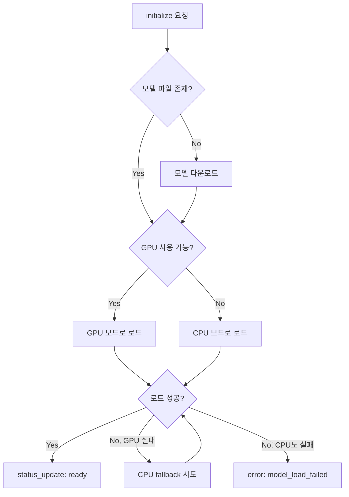
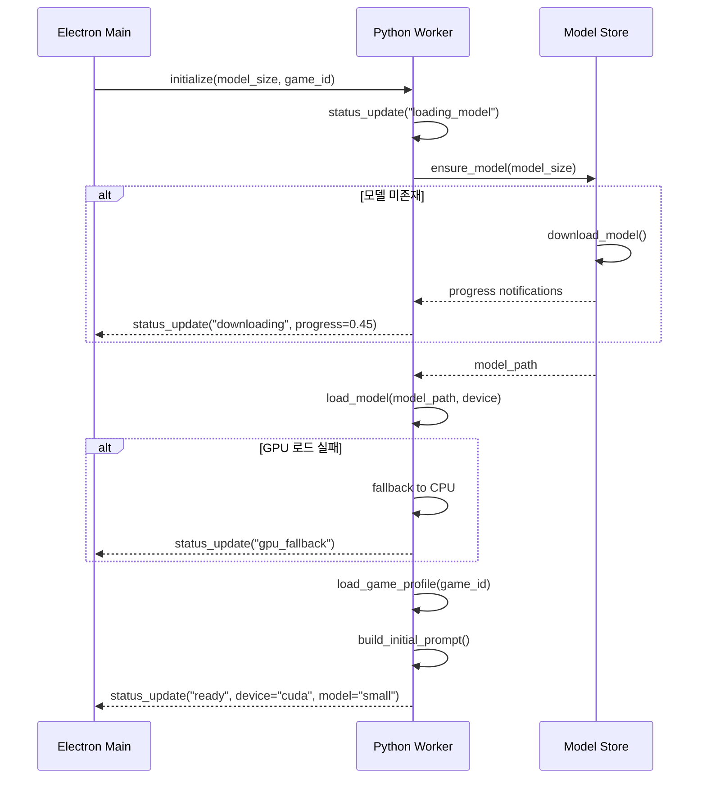
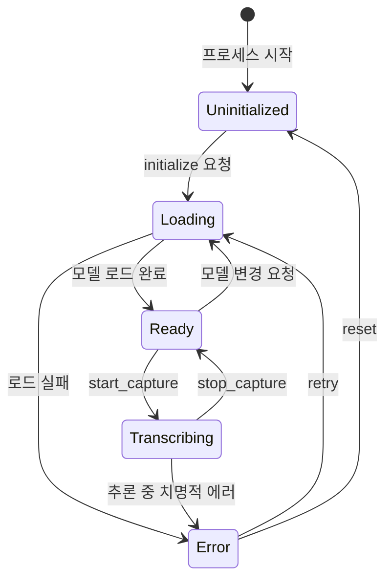

# L2 — STT Runtime Layer

> **상위 문서**: [00-overview.md](./00-overview.md)
> **의존**: [01-audio-capture.md](./01-audio-capture.md) (L1 → L2 인터페이스)
> **버전**: 0.1.0-draft
> **상태**: 초안

---

## 1. 책임 정의

STT Runtime Layer는 **L1이 수집한 오디오로부터 음성 구간을 판별하고, Whisper 모델로 텍스트를 생성하여 L3에 전달**하는 것이 유일한 책임이다.

### 이 레이어가 하는 것

- L1 링 버퍼에서 오디오 데이터 소비 (pull)
- VAD(Voice Activity Detection)로 음성/비음성 구간 판별
- 음성 구간에 대해 Whisper 추론 실행
- 부분 결과(partial)와 확정 결과(final) 구분 생성
- 모델 로드 / 언로드 / GPU↔CPU fallback 관리
- Whisper `initial_prompt`에 게임 프로필 hotword 주입

### 이 레이어가 하지 않는 것

- 오디오 캡처 → L1 책임
- 용어집 기반 텍스트 교정 → L3 책임
- UI 표시 → L4 책임
- 학습 / 용어집 갱신 → L5 책임

---

## 2. 내부 파이프라인

```text
L1 AudioBuffer
    │
    │ pull (read)
    ↓
┌─────────────────────────────────────────────────────┐
│                  L2 STT Runtime                      │
│                                                      │
│  ┌──────────┐    ┌──────────┐    ┌───────────────┐   │
│  │ Audio    │───→│   VAD    │───→│   Inference   │   │
│  │ Consumer │    │ (Silero) │    │(faster-whisper)│   │
│  └──────────┘    └──────────┘    └───────┬───────┘   │
│                                          │           │
│                    ┌─────────────────────┤           │
│                    ↓                     ↓           │
│              ┌──────────┐         ┌──────────┐       │
│              │ Partial  │         │  Final   │       │
│              │ Emitter  │         │ Emitter  │       │
│              └─────┬────┘         └────┬─────┘       │
│                    │                   │             │
└────────────────────┼───────────────────┼─────────────┘
                     ↓                   ↓
              IPC notification     IPC notification
              → Electron UI        → L3 Post-processing
```

---

## 3. VAD (Voice Activity Detection)

### 3.1 왜 VAD가 먼저인가

Whisper에 침묵 구간을 넘기면 **환각(hallucination)** 이 발생한다. "thank you", "자막", 또는 반복 문구를 생성하는 현상이 대표적이다. VAD로 음성 구간만 추출하면:

- 환각 방지
- 불필요한 추론 제거 → GPU/CPU 부하 절감
- 자막 구간의 시작/종료 타임스탬프 정확도 향상

### 3.2 VAD 엔진 선택: Silero VAD

| 기준 | Silero VAD | WebRTC VAD | faster-whisper 내장 VAD |
|------|-----------|------------|----------------------|
| 정확도 | ★★★★★ | ★★★☆☆ | ★★★★☆ (Silero 기반) |
| 지연 | ~30ms | ~10ms | ~30ms |
| 모델 크기 | ~2MB | 없음 (규칙 기반) | ~2MB |
| Python 통합 | ✓ (torch 또는 onnx) | ✓ | ✓ (내장) |
| **선택** | ✓ (faster-whisper 내장 활용) | | |

**결정**: faster-whisper의 내장 Silero VAD를 사용한다. 별도 VAD 라이브러리를 설치하지 않는다.

### 3.3 VAD 파라미터

| 파라미터 | 값 | 설명 |
|----------|-----|------|
| `vad_filter` | `True` | VAD 활성화 |
| `vad_parameters.threshold` | `0.5` | 음성 판별 임계값 (0.0~1.0) |
| `vad_parameters.min_speech_duration_ms` | `250` | 이보다 짧은 음성은 무시 |
| `vad_parameters.min_silence_duration_ms` | `800` | 이 시간 이상 침묵이면 발화 종료로 판정 |
| `vad_parameters.speech_pad_ms` | `200` | 음성 구간 전후로 패딩 추가 |

> **`min_silence_duration_ms = 800`의 근거**: 격투 게임 해설은 빠른 호흡과 짧은 멈춤이 잦다. 일반 대화(1500ms)보다 짧게 설정하되, 너무 짧으면 한 문장이 여러 segment로 분리된다. 800ms는 "문장 끝 판정"과 "문장 내 짧은 멈춤 허용" 사이의 균형점이다.

### 3.4 VAD와 L1 청크의 정합

| L1 청크 | VAD 윈도우 | 관계 |
|---------|-----------|------|
| 30ms (480 samples) | Silero: 32ms (512 samples) | 거의 동일. 청크 2~3개를 묶어 VAD에 전달 |

L2의 Audio Consumer는 L1 링 버퍼에서 **64ms 단위** (1024 samples)로 읽어 VAD에 전달한다. 이는 Silero의 최소 입력 크기(512 samples)의 2배로, 판별 안정성을 위한 것이다.

---

## 4. Whisper 추론

### 4.1 모델 관리

#### 모델 저장 경로

```text
~/.luciper/
├── models/
│   ├── faster-whisper-tiny/
│   ├── faster-whisper-base/
│   ├── faster-whisper-small/
│   └── faster-whisper-medium/
└── config.json  # 현재 선택된 모델, 장치 설정 등
```

#### 모델 로드 흐름



#### 모델 다운로드

```python
from faster_whisper.utils import download_model

def ensure_model(model_size: str, model_dir: Path) -> Path:
    """모델이 없으면 다운로드하고, 경로를 반환한다."""
    model_path = model_dir / f"faster-whisper-{model_size}"
    if not model_path.exists():
        # IPC로 다운로드 진행률을 Electron에 보고
        download_model(model_size, output_dir=str(model_path))
    return model_path
```

### 4.2 추론 설정

| 파라미터 | 값 | 근거 |
|----------|-----|------|
| `model_size` | 설정에 따라 (기본: `small` GPU / `base` CPU) | [00-overview.md §6.3](./00-overview.md) 참조 |
| `device` | `cuda` 또는 `cpu` | 런타임 감지 |
| `compute_type` | `float16` (GPU) / `int8` (CPU) | 속도-정확도 균형 |
| `language` | `ko` | 한국어 고정 (V1). V3에서 다중 언어 |
| `beam_size` | `5` | 기본값. CPU에서는 `1`로 감소 가능 |
| `initial_prompt` | 게임 프로필에서 로드 | §4.3 참조 |
| `vad_filter` | `True` | §3 참조 |
| `word_timestamps` | `True` | 단어 수준 타임스탬프로 partial 정확도 향상 |

### 4.3 Initial Prompt 전략

Whisper의 `initial_prompt`는 **생성될 텍스트의 스타일과 용어를 유도**하는 데 사용한다. 모델 재학습 없이 도메인 적응을 달성하는 핵심 수단이다.

#### 게임 프로필에서 로드

```json
// profiles/tekken/profile.json
{
  "game_id": "tekken",
  "whisper_initial_prompt": "철권 격투 게임 실시간 해설. EWGF, 풍신권, 스크류, 벽꽝, 카운터 히트, ws, df, 화란, 드라구노프, 진, 카즈야, 래리, 헤이하치, 점프 킥, 로우 킥, 패링, 프레임."
}
```

#### 구성 규칙

| 규칙 | 근거 |
|------|------|
| 기술 용어를 정확한 표기로 포함 | Whisper가 해당 표기를 생성하도록 유도 |
| 캐릭터 이름 포함 | 고유 명사 인식률 상승 |
| 문맥 설명 포함 ("철권 격투 게임 해설") | Whisper의 컨디셔닝 효과 |
| 길이 제한: **224 토큰 이내** | Whisper 아키텍처의 prompt 토큰 상한 |

#### 동적 확장 (V1.5+)

로컬 용어집에서 `type = hotword`인 항목을 initial_prompt에 동적으로 추가한다.

```python
def build_initial_prompt(profile: GameProfile, lexicon: LexiconStore) -> str:
    """게임 프로필 기본 prompt + 로컬 hotword를 결합한다."""
    base = profile.whisper_initial_prompt
    hotwords = lexicon.get_entries(game_id=profile.game_id, type="hotword", enabled=True)
    extra = ", ".join(hw.target for hw in hotwords)
    combined = f"{base}, {extra}" if extra else base
    # 224 토큰 초과 시 truncate (앞부분 우선 유지)
    return truncate_to_tokens(combined, max_tokens=224)
```

---

## 5. Partial / Final 전략

### 5.1 왜 구분하는가

| 유형 | 용도 | UI 표시 |
|------|------|---------|
| **Partial** | 현재 인식 중인 텍스트. 확정 전까지 변할 수 있음 | 반투명/이탤릭으로 표시, 계속 덮어씀 |
| **Final** | 확정된 자막 구간. 더 이상 변하지 않음 | 정상 텍스트로 자막 리스트에 추가 |

사용자 경험: partial이 보이면 "시스템이 듣고 있다"는 피드백. final이 되면 자막이 확정되어 목록에 쌓인다.

### 5.2 확정 조건

음성 구간이 종료되었다고 VAD가 판정하면 해당 구간의 추론 결과가 **final**이 된다.

```text
음성 감지 시작
    │
    ├─ (음성 지속 중) → 주기적으로 partial 방출
    │
    ├─ 침묵 800ms 이상 감지 (VAD)
    │
    ↓
음성 구간 종료 → 해당 구간 전체로 추론 실행 → final 방출
```

### 5.3 Partial 방출 전략

| 접근 | 설명 | 채택 |
|------|------|------|
| **A. 고정 주기** | N초마다 현재까지의 오디오로 추론 | ✗ (불필요한 추론 낭비) |
| **B. 누적 추론** | 음성 구간이 진행 중일 때, M초마다 해당 구간 전체로 추론하여 partial 갱신 | ✓ |
| **C. partial 없음** | final만 방출 | ✗ (실시간 피드백 없음) |

**채택: B. 누적 추론**

```python
PARTIAL_INTERVAL_SEC = 2.0  # 2초마다 partial 갱신

# 음성 구간이 진행 중인 동안:
# 1. 마지막 partial 방출로부터 2초 경과 시
# 2. 현재까지 축적된 음성 오디오 전체를 Whisper에 전달
# 3. 결과를 partial로 방출 (이전 partial을 대체)
```

### 5.4 Partial/Final 데이터 구조

```python
@dataclass
class TranscriptionResult:
    """L2가 생산하고 L3/UI가 소비하는 전사 결과."""
    result_type: Literal["partial", "final"]
    segment_id: str             # UUID, partial→final 매핑에 사용
    text: str                   # 전사된 텍스트 (후처리 전 raw)
    start_time: float           # 세션 기준 시작 시각 (초)
    end_time: float             # 세션 기준 종료 시각 (초)
    confidence: float           # 추론 신뢰도 (0.0~1.0)
    language: str               # 감지된 언어 코드
    word_timestamps: list[WordTimestamp] | None  # 단어별 타임스탬프

@dataclass
class WordTimestamp:
    word: str
    start: float
    end: float
    probability: float
```

---

## 6. 스레딩 모델

### 6.1 구조

```text
Python STT Worker Process
│
├── Main Thread
│   ├── JSON-RPC 메시지 수신/발신 (stdio)
│   └── 상태 관리, 명령 디스패치
│
├── Audio Consumer Thread
│   ├── L1 링 버퍼에서 오디오 pull (64ms 단위)
│   ├── VAD 실행
│   └── 음성 구간 오디오를 Inference Queue에 적재
│
└── Inference Thread
    ├── Inference Queue에서 음성 구간 소비
    ├── Whisper 추론 실행
    ├── partial/final 결과 생성
    └── 결과를 Main Thread에 전달 → IPC 발송
```

### 6.2 스레드 간 통신

| 경로 | 메커니즘 | 데이터 |
|------|---------|--------|
| Main → Audio Consumer | `threading.Event` | start/stop 신호 |
| Audio Consumer → Inference | `queue.Queue` | 음성 구간 오디오 (`SpeechSegment`) |
| Inference → Main | `queue.Queue` | `TranscriptionResult` |

```python
@dataclass
class SpeechSegment:
    """VAD가 감지한 음성 구간. Audio Consumer → Inference Thread."""
    audio: np.ndarray       # int16, 16kHz, mono
    start_time: float       # 세션 기준 시작 시각
    is_ongoing: bool        # True면 아직 발화 진행 중 (partial용)
    segment_id: str         # partial→final 추적용 UUID
```

### 6.3 왜 멀티프로세스가 아닌 멀티스레드인가

- Python GIL 제약이 있지만, **Whisper 추론은 CTranslate2 (C++ 네이티브)** 에서 실행되므로 GIL을 릴리스한다
- 오디오 캡처도 **sounddevice 콜백 (PortAudio C 레이어)** 에서 실행되므로 GIL 영향 없음
- 멀티프로세스는 공유 메모리 관리가 복잡하고, GPU 컨텍스트 공유가 어려움
- 따라서 **CPU-바운드 작업이 GIL을 릴리스하는 구조에서는 멀티스레드가 적합**

---

## 7. 성능 제약 및 대응

### 7.1 실시간 제약

**"실시간"의 정의**: 추론 지연이 음성 구간 길이의 50% 이하여야 한다.

| 시나리오 | 음성 길이 | 허용 지연 | `small` GPU | `base` CPU |
|----------|----------|----------|-------------|------------|
| 짧은 발화 | 3초 | 1.5초 | ✓ (~0.5초) | ✓ (~1초) |
| 보통 발화 | 10초 | 5초 | ✓ (~1초) | ✓ (~3초) |
| 긴 발화 | 30초 | 15초 | ✓ (~2초) | △ (~10초) |

### 7.2 CPU 모드 최적화

CPU 환경에서 실시간성을 유지하기 위한 조치:

| 조치 | 내용 |
|------|------|
| 모델 축소 | CPU에서는 `base` 또는 `tiny`로 제한 |
| `compute_type` | `int8` 양자화 (속도 2~3배 향상) |
| `beam_size` | `1`로 감소 (greedy decoding) |
| partial 비활성화 | CPU에서는 partial 주기를 5초로 늘리거나 비활성화 |
| `condition_on_previous_text` | `False` (이전 결과를 참조하지 않아 메모리 절감) |

### 7.3 GPU 메모리 관리

| 상황 | 대응 |
|------|------|
| VRAM 부족으로 모델 로드 실패 | CPU fallback + 사용자 안내 |
| 게임과 GPU 경합 | Whisper의 GPU 사용률이 게임 FPS에 영향을 줄 수 있음 → CPU 모드 권장 안내 |
| 추론 중 OOM | 자동 복구: 모델 언로드 → CPU 모드 재로드 |

---

## 8. 모델 초기화 시퀀스

`initialize` IPC 호출 시 실행되는 전체 흐름:



---

## 9. 상태 머신



| 상태 | VAD | 추론 | 설명 |
|------|-----|------|------|
| `Uninitialized` | ✗ | ✗ | 프로세스 시작 직후, 모델 미로드 |
| `Loading` | ✗ | ✗ | 모델 다운로드/로드 중 |
| `Ready` | ✗ | ✗ | 모델 로드 완료, 캡처 대기 |
| `Transcribing` | ✓ | ✓ | 오디오 소비 + VAD + 추론 활성 |
| `Error` | ✗ | ✗ | 복구 대기 |

---

## 10. 에러 처리

### 10.1 에러 분류

| 에러 | 심각도 | 복구 전략 |
|------|--------|----------|
| 모델 파일 손상 / 누락 | `critical` | 재다운로드 안내 |
| GPU OOM (모델 로드 시) | `error` | CPU fallback 자동 시도 |
| GPU OOM (추론 중) | `error` | 모델 언로드 → CPU 모드 재로드 |
| CTranslate2 추론 예외 | `error` | 해당 segment 스킵, 로그 기록, 다음 segment 계속 |
| VAD 연속 실패 | `warning` | 로그 기록, 임시 우회 (VAD 없이 고정 간격 추론) |
| 모델 다운로드 네트워크 오류 | `error` | 재시도 3회, 실패 시 오프라인 안내 |

### 10.2 Segment 수준 복구

추론 중 개별 segment에서 에러가 발생하면 **해당 segment만 스킵**하고 다음을 계속 처리한다. 전체 세션을 중단하지 않는다.

```python
def _process_segment(self, segment: SpeechSegment) -> TranscriptionResult | None:
    """단일 음성 구간을 추론한다. 실패 시 None 반환."""
    try:
        segments, info = self._model.transcribe(
            segment.audio,
            language=self._language,
            initial_prompt=self._initial_prompt,
            beam_size=self._beam_size,
            vad_filter=False,  # L2 자체 VAD 이미 적용됨
            word_timestamps=True,
        )
        text = " ".join(s.text for s in segments)
        return TranscriptionResult(
            result_type="final" if not segment.is_ongoing else "partial",
            segment_id=segment.segment_id,
            text=text.strip(),
            start_time=segment.start_time,
            end_time=segment.start_time + len(segment.audio) / 16000,
            confidence=info.language_probability,
            language=info.language,
            word_timestamps=self._extract_word_timestamps(segments),
        )
    except Exception as e:
        logger.error(f"Transcription failed for segment {segment.segment_id}: {e}")
        return None
```

---

## 11. IPC 메서드 (L2 관련)

### 11.1 Electron → Python

#### `initialize`

```json
{
  "jsonrpc": "2.0",
  "id": 1,
  "method": "initialize",
  "params": {
    "model_size": "small",
    "game_id": "tekken",
    "device": "auto"
  }
}
```

```json
{
  "jsonrpc": "2.0",
  "id": 1,
  "result": {
    "status": "ready",
    "model": "faster-whisper-small",
    "device": "cuda",
    "compute_type": "float16",
    "vram_usage_mb": 1200
  }
}
```

#### `change_model`

```json
{
  "jsonrpc": "2.0",
  "id": 4,
  "method": "change_model",
  "params": {
    "model_size": "base",
    "device": "cpu"
  }
}
```

### 11.2 Python → Electron

#### `partial_result`

```json
{
  "jsonrpc": "2.0",
  "method": "partial_result",
  "params": {
    "segment_id": "seg_a1b2c3",
    "text": "지금 일렉이 깔끔하게",
    "start_time": 45.2,
    "end_time": 47.8,
    "confidence": 0.82
  }
}
```

#### `final_result`

```json
{
  "jsonrpc": "2.0",
  "method": "final_result",
  "params": {
    "segment_id": "seg_a1b2c3",
    "text": "지금 일렉이 깔끔하게 들어갔고 벽꽝까지 연결했습니다",
    "start_time": 45.2,
    "end_time": 51.6,
    "confidence": 0.91,
    "language": "ko",
    "word_timestamps": [
      {"word": "지금", "start": 45.2, "end": 45.5, "probability": 0.95},
      {"word": "일렉이", "start": 45.6, "end": 46.0, "probability": 0.72},
      {"word": "깔끔하게", "start": 46.1, "end": 46.6, "probability": 0.88}
    ]
  }
}
```

> `final_result`는 L3(Post-processing)으로도 전달된다. L3는 이 `text`를 받아 용어집 기반 교정을 적용한 뒤, 교정된 텍스트를 UI에 전달한다.

#### `status_update`

```json
{
  "jsonrpc": "2.0",
  "method": "status_update",
  "params": {
    "state": "downloading",
    "model": "faster-whisper-small",
    "progress": 0.67,
    "message": "모델 다운로드 중... (67%)"
  }
}
```

---

## 12. 테스트 전략

### 12.1 단위 테스트

| 대상 | 테스트 내용 | Mock 대상 |
|------|------------|----------|
| `build_initial_prompt()` | 프로필 + 로컬 hotword 결합, 224 토큰 truncation | `LexiconStore` |
| `ensure_model()` | 존재 시 스킵, 미존재 시 다운로드 호출 | `download_model` |
| VAD 파라미터 적용 | 설정값이 transcribe()에 전달되는지 | `WhisperModel` |
| 상태 전이 | 잘못된 전이 시 예외 | 없음 |
| `_process_segment()` | 정상 추론, 에러 시 None 반환 | `WhisperModel` |
| partial/final 구분 | `is_ongoing` 플래그에 따른 result_type | `WhisperModel` |

### 12.2 통합 테스트

| 시나리오 | 검증 항목 |
|----------|----------|
| 5초 음성 파일 → 전사 | 텍스트 내용 정확도 (한국어 일반 문장) |
| 30초 침묵+음성 혼합 → VAD+전사 | 침묵 구간에서 환각 없음 |
| GPU→CPU fallback | GPU 미가용 시 자동 전환, 에러 없이 전사 완료 |
| 연속 10개 segment 처리 | 메모리 증가 없음, 타임스탬프 연속성 |

### 12.3 벤치마크

| 측정 항목 | 방법 | 목표 |
|----------|------|------|
| 추론 지연 (RTF) | 10초/30초/60초 음성 파일의 추론 시간 측정 | RTF < 0.5 (GPU), < 1.0 (CPU) |
| 메모리 사용 | 30분 연속 세션 중 RSS 추적 | RSS 증가 < 50MB |
| VAD 정밀도 | 수동 라벨링된 10분 오디오로 precision/recall | precision > 0.9, recall > 0.85 |

---

## 13. 파일 구조

```text
src/
└── stt_worker/
    ├── audio/              # L1 (01-audio-capture.md 참조)
    └── stt/
        ├── __init__.py
        ├── runtime.py      # STTRuntime 클래스 (상태 머신, 스레드 조율)
        ├── inference.py    # WhisperInference (모델 로드, 추론 실행)
        ├── vad.py          # VAD 설정, 음성 구간 수집 로직
        ├── prompt.py       # initial_prompt 빌드
        ├── model_store.py  # 모델 다운로드, 경로 관리
        ├── types.py        # TranscriptionResult, SpeechSegment 등
        └── tests/
            ├── test_runtime.py
            ├── test_inference.py
            ├── test_vad.py
            ├── test_prompt.py
            └── test_model_store.py
```

---

## 14. 미결 사항 및 후속 결정

| 항목 | 현재 상태 | 결정 시점 |
|------|----------|----------|
| Partial 방출 주기 (2초) 최적화 | 2초로 시작, 사용자 피드백 기반 조정 | V1.5 |
| `min_silence_duration_ms` 튜닝 | 800ms로 시작 | 철권 해설 실제 녹음으로 테스트 후 |
| 다중 언어 지원 (`language` 감지 모드) | `ko` 고정 | V3에서 언어 선택 UI |
| 스트리밍 추론 (chunked inference) | 비채택 (VAD 기반 구간별 추론) | 향후 지연 최적화 필요 시 재검토 |
| L2 → L3 인터페이스 상세 | `TranscriptionResult` 구조체로 전달 | [03-post-processing.md](./03-post-processing.md) |
