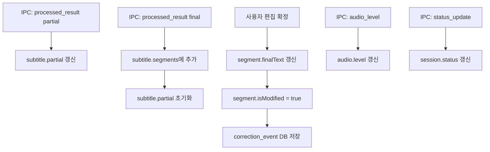

# L4 — Subtitle Editor Layer

> **상위 문서**: [00-overview.md](./00-overview.md)
> **의존**: [03-post-processing.md](./03-post-processing.md) (L3 → L4 인터페이스)
> **버전**: 0.1.0-draft
> **상태**: 초안

---

## 1. 책임 정의

Subtitle Editor Layer는 **L3에서 후처리된 자막을 표시하고, 사용자가 검수·수정할 수 있는 UI를 제공하며, 수정 기록을 저장**하는 것이 책임이다.

### 이 레이어가 하는 것

- 실시간 자막 표시 (partial → final 전환)
- 확정 자막 리스트 표시 및 인라인 편집
- 수정 전/후 차이 기록 (`correction_events`)
- 검색 / 치환
- 자막 파일 내보내기 (SRT, TXT)
- 세션 상태 표시 (녹음 중, 일시정지 등)

### 이 레이어가 하지 않는 것

- STT 추론 / 후처리 → L2, L3 책임
- 학습 제안 / 용어집 갱신 → L5 책임
- 오디오 캡처 제어 → L1 책임 (UI에서 버튼은 제공하되, 실행은 IPC를 통해 L1에 위임)

### 핵심 UX 원칙

> **수정 중에는 어떠한 팝업, 추천, 알림도 표시하지 않는다.**
>
> 학습 제안은 세션 종료/저장 직전에만 한 번 표시된다 (L5 책임).

---

## 2. UI 구성

### 2.1 전체 레이아웃

```text
┌─────────────────────────────────────────────────────────┐
│  Header Bar                                              │
│  [● REC 00:05:23]  [⏸ Pause]  [■ Stop]  [⚙ Settings]   │
├─────────────────────────────────────────────────────────┤
│                                                          │
│  Live Preview (partial)                                  │
│  ┌───────────────────────────────────────────────────┐   │
│  │  "지금 EWGF가 깔끔하게..."  (인식 중)              │   │
│  └───────────────────────────────────────────────────┘   │
│                                                          │
├─────────────────────────────────────────────────────────┤
│                                                          │
│  Subtitle List (final segments)                          │
│  ┌───┬──────────┬──────────────────────────────┬─────┐  │
│  │ # │ Time     │ Text                         │ ... │  │
│  ├───┼──────────┼──────────────────────────────┼─────┤  │
│  │ 1 │ 00:00:03 │ 자 지금 1라운드 시작합니다     │  ✎  │  │
│  │ 2 │ 00:00:08 │ EWGF 깔끔하게 들어갔고 벽꽝…  │  ✎● │  │
│  │ 3 │ 00:00:15 │ CH 확인하고 콤보로 연결했네요  │  ✎  │  │
│  │ … │          │                              │     │  │
│  └───┴──────────┴──────────────────────────────┴─────┘  │
│                                                          │
├─────────────────────────────────────────────────────────┤
│  Status Bar                                              │
│  [Segments: 47]  [Modified: 3]  [🔍 Search]  [💾 Save]  │
└─────────────────────────────────────────────────────────┘
```

### 2.2 영역별 역할

| 영역 | 역할 |
|------|------|
| **Header Bar** | 세션 상태 (녹음 시간, 상태), 컨트롤 버튼, 설정 접근 |
| **Live Preview** | 현재 인식 중인 partial 텍스트 표시. 한 줄, 계속 덮어씀 |
| **Subtitle List** | 확정된 final segment 목록. 스크롤, 인라인 편집 가능 |
| **Status Bar** | 통계 (총 segment 수, 수정 수), 검색 토글, 저장/내보내기 |

---

## 3. Subtitle List (핵심 컴포넌트)

### 3.1 설계 결정: 리스트형 편집기

| 방식 | V1 채택 | 근거 |
|------|---------|------|
| **리스트형** (타임코드 + 텍스트) | ✓ | 개발 비용 최소, 자막 검수 툴의 표준 UX |
| 타임라인형 (waveform + 드래그) | ✗ (V3) | 개발 비용 과대, MVP에 불필요 |

### 3.2 Segment 행 구조

각 행은 하나의 `final` segment를 표시한다.

```text
┌───────────────────────────────────────────────────────┐
│  #12   00:01:45 - 00:01:52                        ✎●  │
│  ┌─────────────────────────────────────────────────┐  │
│  │ EWGF 깔끔하게 들어갔고 벽꽝까지 연결했습니다     │  │
│  └─────────────────────────────────────────────────┘  │
│  ┄┄┄┄┄┄┄┄┄┄┄┄┄┄┄┄┄┄┄┄┄┄┄┄┄┄┄┄┄┄┄┄┄┄┄┄┄┄┄┄┄┄┄┄┄┄┄┄ │
│  후처리: ewgf→EWGF, 벽강→벽꽝              (접힌 상태) │
└───────────────────────────────────────────────────────┘
```

| 요소 | 설명 |
|------|------|
| **#번호** | Segment 순번 |
| **타임코드** | `start_time - end_time` (HH:MM:SS 또는 MM:SS) |
| **텍스트** | `processed_text` (L3 후처리 결과). 클릭 시 인라인 편집 |
| **✎ 아이콘** | 편집 모드 진입 (또는 텍스트 클릭으로도 진입) |
| **● 표시** | 사용자가 수정한 segment에 표시 (수정 여부 시각 표시) |
| **후처리 정보** | 접힌 상태로 L3 교정 내역 표시. 펼치면 raw → processed 비교 |

### 3.3 인라인 편집

```text
[편집 전]
│ EWGF 깔끔하게 들어갔고 벽꽝까지 연결했습니다     │

[편집 중] (텍스트 클릭 시)
│ EWGF 깔끔하게 들어갔고 벽꽝까지 연결했습니다|    │
                                           ↑ 커서

[편집 완료] (Enter 또는 포커스 아웃)
→ correction_event 저장
→ ● 수정 표시 활성화
```

#### 편집 규칙

| 규칙 | 내용 |
|------|------|
| 진입 | 텍스트 영역 클릭 또는 `Enter` 키 |
| 확정 | `Enter` (줄바꿈 없음) 또는 포커스 아웃 |
| 취소 | `Escape` → 편집 전 상태로 복원 |
| Undo | `Ctrl+Z` → 이전 텍스트로 복원 (segment 단위 undo stack) |
| 다음 행 | `Tab` → 현재 편집 확정 + 다음 segment로 이동 |
| 이전 행 | `Shift+Tab` → 현재 편집 확정 + 이전 segment로 이동 |

---

## 4. Live Preview (Partial 표시)

### 4.1 동작

```text
[partial 수신 시]
1. Live Preview 영역의 텍스트를 새 partial로 교체 (덮어쓰기)
2. 반투명 + 이탤릭 스타일로 표시
3. "인식 중..." 인디케이터 표시

[final 수신 시]
1. Live Preview 영역 초기화 (빈 상태 또는 "대기 중")
2. 해당 segment를 Subtitle List 하단에 추가
3. 자동 스크롤: 사용자가 목록 상단을 편집 중이 아니면 하단으로 스크롤
```

### 4.2 자동 스크롤 정책

| 조건 | 스크롤 동작 |
|------|------------|
| 사용자가 **마지막 segment 근처**를 보고 있음 | 새 segment 추가 시 자동 하단 스크롤 |
| 사용자가 **상단 segment를 편집 중** | 스크롤 동결 (편집 방해 금지) |
| 사용자가 **수동으로 상단 스크롤** | 자동 스크롤 비활성화, "↓ 최신으로" 버튼 표시 |

---

## 5. 수정 기록 (Correction Events)

### 5.1 기록 대상

사용자가 segment의 텍스트를 변경하면 `correction_event`를 생성한다.

```typescript
interface CorrectionEvent {
  correctionId: string;       // UUID
  segmentId: string;          // 수정된 segment
  originalText: string;       // 수정 전 텍스트 (processed_text)
  correctedText: string;      // 수정 후 텍스트
  correctionType: "manual";   // V1은 manual만
  createdAt: string;          // ISO 8601
}
```

### 5.2 기록 시점

| 이벤트 | 기록 여부 |
|--------|----------|
| 사용자가 텍스트를 수정하고 확정 | ✓ |
| 사용자가 수정 후 Undo | 이전 correction 무효화 (soft delete) |
| 검색/치환으로 일괄 변경 | 변경된 각 segment마다 개별 correction |
| L3 후처리 적용 (자동) | ✗ (자동 교정은 L3의 corrections에 이미 기록) |

### 5.3 저장

correction_event는 **즉시 SQLite에 기록**한다 (메모리에만 유지하면 크래시 시 손실).

```sql
CREATE TABLE correction_events (
    correction_id TEXT PRIMARY KEY,
    segment_id TEXT NOT NULL REFERENCES subtitle_segments(segment_id),
    original_text TEXT NOT NULL,
    corrected_text TEXT NOT NULL,
    correction_type TEXT NOT NULL DEFAULT 'manual',
    is_active INTEGER NOT NULL DEFAULT 1,   -- 0이면 undo됨
    created_at TEXT NOT NULL
);
```

---

## 6. 검색 / 치환

### 6.1 UI

```text
┌─────────────────────────────────────────────────┐
│ 🔍 [검색어 입력          ]  [이전] [다음]  [×]   │
│ ↔  [치환어 입력          ]  [치환] [모두 치환]    │
│    ☐ 대소문자 구분   ☐ 정규식                     │
└─────────────────────────────────────────────────┘
```

`Ctrl+F`로 검색 바 토글. `Ctrl+H`로 치환 바 토글.

### 6.2 동작

| 기능 | 동작 |
|------|------|
| 검색 | 모든 segment의 `final_text`에서 매칭, 매칭 행 하이라이트, 텍스트 내 매칭 부분 강조 |
| 이전/다음 | 매칭 결과 간 순회, 해당 행으로 스크롤 |
| 치환 | 현재 매칭 부분만 치환, `correction_event` 생성 |
| 모두 치환 | 전체 매칭 일괄 치환, 각 segment별 `correction_event` 생성 |
| 정규식 | 선택적 — 정규식 패턴 매칭 지원 |

### 6.3 치환과 학습의 관계

"모두 치환"은 같은 패턴의 수정이 여러 segment에 걸쳐 발생하는 것이므로, L5가 세션 종료 시 **고신뢰 학습 후보**로 인식할 수 있다 (동일 교정이 반복됨).

---

## 7. 내보내기 (Export)

### 7.1 지원 형식

| 형식 | 확장자 | 내용 |
|------|--------|------|
| **SRT** | `.srt` | 타임코드 + 텍스트 (자막 표준) |
| **Plain Text** | `.txt` | 타임코드 없이 텍스트만 |
| **JSON** | `.json` | 전체 세션 데이터 (raw + processed + corrections) |

### 7.2 SRT 출력 예시

```srt
1
00:00:03,200 --> 00:00:07,800
자 지금 1라운드 시작합니다

2
00:00:08,100 --> 00:00:12,500
EWGF 깔끔하게 들어갔고 벽꽝까지 연결했습니다

3
00:00:15,300 --> 00:00:19,700
CH 확인하고 콤보로 연결했네요
```

### 7.3 내보내기에 사용되는 텍스트

| 필드 | 설명 |
|------|------|
| `final_text` | 사용자가 수정했으면 수정본, 아니면 `processed_text` |

```text
우선순위: user_edit > processed_text > raw_text
```

---

## 8. 컴포넌트 구조 (React)

### 8.1 컴포넌트 트리

```text
<EditorPage>
├── <HeaderBar>
│   ├── <SessionTimer />
│   ├── <RecordingControls />     // Start, Pause, Stop
│   ├── <AudioLevelMeter />       // L1에서 수신한 레벨
│   └── <SettingsButton />
│
├── <LivePreview>
│   └── <PartialText />           // partial 텍스트 표시
│
├── <SubtitleList>
│   ├── <SearchBar />             // Ctrl+F 검색/치환
│   └── <SegmentRow>[]            // 가상 스크롤 적용
│       ├── <SegmentTimecode />
│       ├── <SegmentText />       // 인라인 편집 가능
│       ├── <EditIndicator />     // ● 수정 여부
│       └── <CorrectionDetail />  // 접힘/펼침: L3 교정 내역
│
└── <StatusBar>
    ├── <SegmentCount />
    ├── <ModifiedCount />
    └── <ExportButton />          // Save / Download
```

### 8.2 가상 스크롤

장시간 세션 시 segment가 수백 개까지 쌓일 수 있다. **가상 스크롤(virtualization)** 을 적용하여 렌더링 성능을 확보한다.

| 항목 | 결정 |
|------|------|
| 라이브러리 | `react-window` 또는 `@tanstack/virtual` |
| 행 높이 | 가변 (텍스트 길이에 따라) |
| 버퍼 | viewport 위아래 5행씩 사전 렌더링 |
| 예상 segment 수 | 1시간 세션 ≈ 200~400 segments |

---

## 9. 상태 관리

### 9.1 Electron Renderer 상태 구조

```typescript
interface EditorState {
  // 세션
  session: {
    id: string;
    status: "idle" | "recording" | "paused" | "stopped";
    startedAt: string | null;
    elapsedSec: number;
  };

  // 실시간 오디오
  audio: {
    level: number;            // 0.0 ~ 1.0
    deviceName: string;
  };

  // 자막
  subtitle: {
    partial: PartialSegment | null;
    segments: FinalSegment[];   // 시간순 정렬
    editingSegmentId: string | null;
  };

  // 검색
  search: {
    isOpen: boolean;
    query: string;
    matchIndices: number[];     // 매칭된 segment index
    currentMatchIndex: number;
    isRegex: boolean;
    caseSensitive: boolean;
  };

  // 통계
  stats: {
    totalSegments: number;
    modifiedSegments: number;
  };
}

interface PartialSegment {
  segmentId: string;
  text: string;               // L3 processed
  startTime: number;
}

interface FinalSegment {
  segmentId: string;
  startTime: number;
  endTime: number;
  rawText: string;            // L2 원본
  processedText: string;      // L3 후처리
  finalText: string;          // 사용자 수정본 (없으면 processedText)
  isModified: boolean;
  corrections: CorrectionRecord[];      // L3 교정 내역
  phraseAnnotations: PhraseAnnotation[];
}
```

### 9.2 상태 갱신 흐름



### 9.3 상태 관리 도구

| 선택지 | V1 채택 | 근거 |
|--------|---------|------|
| **React Context + useReducer** | ✓ | 상태 구조가 단순하고, 외부 라이브러리 불필요 |
| Redux / Zustand | ✗ | 오버엔지니어링. segment 목록 외에 복잡한 상태 없음 |

---

## 10. IPC 이벤트 핸들링 (Renderer)

### 10.1 Electron Renderer에서의 수신

```typescript
// preload.ts에서 노출된 API를 통해 IPC 이벤트 수신
window.electronAPI.onProcessedResult((result: ProcessedResult) => {
  if (result.resultType === "partial") {
    dispatch({ type: "UPDATE_PARTIAL", payload: result });
  } else {
    dispatch({ type: "ADD_FINAL_SEGMENT", payload: result });
  }
});

window.electronAPI.onAudioLevel((data: { level: number }) => {
  dispatch({ type: "UPDATE_AUDIO_LEVEL", payload: data.level });
});

window.electronAPI.onStatusUpdate((data: StatusUpdate) => {
  dispatch({ type: "UPDATE_SESSION_STATUS", payload: data });
});

window.electronAPI.onCaptureError((error: CaptureError) => {
  dispatch({ type: "SET_ERROR", payload: error });
});
```

### 10.2 Renderer에서 Python으로의 명령

```typescript
// 녹음 시작
async function handleStartRecording(deviceId: string) {
  await window.electronAPI.invoke("start_capture", { device_id: deviceId });
  dispatch({ type: "SET_SESSION_STATUS", payload: "recording" });
}

// 녹음 중지
async function handleStopRecording() {
  const summary = await window.electronAPI.invoke("stop_capture");
  dispatch({ type: "SET_SESSION_STATUS", payload: "stopped" });
  // → L5 학습 제안 패널로 전환
}

// 내보내기
async function handleExport(format: "srt" | "txt" | "json") {
  const segments = state.subtitle.segments;
  const content = formatExport(segments, format);
  await window.electronAPI.invoke("save_file", { content, format });
}
```

---

## 11. 세션 종료 → L5 전환

세션 종료(Stop 버튼 또는 내보내기)는 L4에서 L5로의 **전환점**이다.

### 11.1 전환 흐름

```text
1. 사용자가 [■ Stop] 클릭
2. L1 캡처 중지, L2 추론 완료 대기
3. 모든 pending partial → final로 강제 확정
4. 편집기 상태: "recording" → "stopped"
5. 사용자가 자막을 추가로 수정할 시간 제공
6. 사용자가 [💾 Save / Export] 클릭
7. ──── 여기서 L5 학습 제안 패널 표시 ────
8. 학습 제안 처리 후 파일 저장/다운로드
```

### 11.2 Stop → Save 사이

사용자는 녹음을 멈춘 뒤에도 **자유롭게 자막을 수정**할 수 있다. Save/Export를 누르기 전까지는 L5 학습 제안이 표시되지 않는다.

> 이 구간은 "편집 전용 모드"로, 실시간 자막이 더 이상 추가되지 않으므로 편집에 집중할 수 있다.

---

## 12. 키보드 단축키

| 단축키 | 동작 | 조건 |
|--------|------|------|
| `Space` | 녹음 시작 / 일시정지 토글 | 편집 중이 아닐 때 |
| `Ctrl+S` | 저장 (L5 학습 제안 → 파일 저장) | 항상 |
| `Ctrl+F` | 검색 바 토글 | 항상 |
| `Ctrl+H` | 검색+치환 바 토글 | 항상 |
| `Ctrl+Z` | Undo (현재 segment) | 편집 중 |
| `Ctrl+Shift+Z` | Redo | 편집 중 |
| `Enter` | 편집 확정 / 편집 모드 진입 | segment 선택 시 |
| `Escape` | 편집 취소 / 검색 바 닫기 | 편집 중 또는 검색 중 |
| `Tab` | 다음 segment로 이동 + 편집 | 편집 중 |
| `Shift+Tab` | 이전 segment로 이동 + 편집 | 편집 중 |
| `↑ / ↓` | segment 간 이동 | 편집 중이 아닐 때 |

---

## 13. 시각 디자인 가이드라인

### 13.1 Segment 상태별 스타일

| 상태 | 배경 | 텍스트 | 아이콘 |
|------|------|--------|--------|
| 기본 (미수정) | 투명 | 기본색 | 없음 |
| 후처리 적용됨 | 투명 | 기본색 | 작은 마크 (교정이 적용되었음을 암시) |
| 사용자 수정됨 | 연한 강조 | 기본색 | ● (수정됨) |
| 편집 중 | 포커스 테두리 | 기본색 | ✎ (편집 모드) |
| 검색 매칭 | 노란 하이라이트 | 기본색 | 없음 |

### 13.2 Partial 표시 스타일

| 속성 | 값 |
|------|-----|
| 투명도 | 60% |
| 폰트 스타일 | 이탤릭 |
| 인디케이터 | 좌측에 파동 애니메이션 (인식 중) |
| 위치 | Subtitle List 상단, 고정 |

### 13.3 후처리 Diff 표시

접힌 상태에서 펼치면 L3 교정 내역을 보여줄때:

```text
원본(raw):    "지금 ewgf가 깔끔하게 들어갔고 벽강까지 연결했습니다"
후처리:       "지금 EWGF가 깔끔하게 들어갔고 벽꽝까지 연결했습니다"
                   ────                       ──
                   ewgf→EWGF                 벽강→벽꽝
```

교정된 부분에 밑줄 + 원본 표시. 복잡한 diff 라이브러리 없이, L3의 `corrections` 배열을 UI에서 직접 렌더링한다.

---

## 14. 에러 처리

| 에러 | UI 대응 |
|------|---------|
| IPC 연결 끊김 | 상단에 빨간 배너 "연결 끊김. 재연결 중..." + 자동 재연결 시도 |
| 캡처 장치 분리 | 배너 "마이크 연결이 끊어졌습니다" + 녹음 자동 일시정지 |
| 모델 로드 실패 | 모달 "모델 로드 실패. 설정에서 다른 모델을 선택하세요" |
| 저장 실패 (디스크) | 토스트 "저장 실패: 디스크 공간을 확인하세요" |
| 대용량 세션 (500+ segments) | 성능 저하 경고 없음 (가상 스크롤로 처리) |

---

## 15. 테스트 전략

### 15.1 컴포넌트 단위 테스트

| 컴포넌트 | 테스트 내용 | 도구 |
|----------|------------|------|
| `<SegmentRow>` | 텍스트 표시, 편집 모드 전환, 수정 확정/취소 | React Testing Library |
| `<LivePreview>` | partial 텍스트 갱신, final 전환 시 초기화 | React Testing Library |
| `<SearchBar>` | 검색 매칭, 치환 동작, 정규식 토글 | React Testing Library |
| `<AudioLevelMeter>` | 레벨 값에 따른 시각 변화 | React Testing Library |
| `<ExportButton>` | 각 형식별 출력 포맷 정확성 | Jest |

### 15.2 통합 테스트

| 시나리오 | 검증 |
|----------|------|
| IPC partial 5개 → final 1개 | partial 덮어쓰기, final 리스트 추가, partial 초기화 |
| Segment 편집 → Undo → Redo | correction_event 생성/비활성화/재활성화 |
| 검색 "EWGF" → 치환 "이윈갓피" → 모두 치환 | 모든 매칭 segment 수정, 각각 correction 기록 |
| 300 segments 스크롤 | 렌더링 성능 (FPS > 30) |

### 15.3 수동 검증

| 항목 | 방법 |
|------|------|
| 편집 UX 흐름 | 실제 녹음 세션 후 자막 검수 시뮬레이션 |
| 자동 스크롤 | 상단 편집 중 새 segment 추가 시 스크롤 동결 확인 |
| 내보내기 | SRT 파일을 VLC에서 재생하여 타임코드 정확도 확인 |
| 키보드 내비게이션 | Tab/Shift+Tab으로 연속 편집 흐름 |

---

## 16. 파일 구조

```text
src/
└── renderer/
    ├── App.tsx
    ├── pages/
    │   └── EditorPage.tsx
    ├── components/
    │   ├── header/
    │   │   ├── HeaderBar.tsx
    │   │   ├── SessionTimer.tsx
    │   │   ├── RecordingControls.tsx
    │   │   └── AudioLevelMeter.tsx
    │   ├── subtitle/
    │   │   ├── SubtitleList.tsx
    │   │   ├── SegmentRow.tsx
    │   │   ├── SegmentText.tsx          # 인라인 편집
    │   │   ├── CorrectionDetail.tsx     # 후처리 diff 표시
    │   │   └── LivePreview.tsx
    │   ├── search/
    │   │   └── SearchBar.tsx
    │   └── status/
    │       ├── StatusBar.tsx
    │       └── ExportButton.tsx
    ├── state/
    │   ├── EditorContext.tsx
    │   ├── editorReducer.ts
    │   └── types.ts
    ├── hooks/
    │   ├── useIpcListener.ts
    │   ├── useAutoScroll.ts
    │   └── useSegmentEdit.ts
    ├── utils/
    │   ├── export.ts                    # SRT, TXT, JSON 포매팅
    │   └── timeFormat.ts
    └── __tests__/
        ├── SegmentRow.test.tsx
        ├── LivePreview.test.tsx
        ├── SearchBar.test.tsx
        ├── editorReducer.test.ts
        └── export.test.ts
```

---

## 17. 미결 사항 및 후속 결정

| 항목 | 현재 상태 | 결정 시점 |
|------|----------|----------|
| Segment 병합/분할 기능 | V1 제외 | V1.5에서 사용자 피드백 기반 |
| 타임코드 수동 조정 | V1 제외 (타임코드는 L2 생성값 고정) | V3 타임라인 편집기 |
| Undo/Redo 범위 | Segment 단위 (전역 undo 아님) | V1.5 |
| 다크 모드 | V1부터 기본 다크 모드 | - |
| 접근성 (a11y) | 키보드 내비게이션 기본 지원, 스크린리더는 V1.5 | V1.5 |
| L5 학습 패널 UI | L5 문서에서 정의 | [05-lexicon-learning.md](./05-lexicon-learning.md) |
