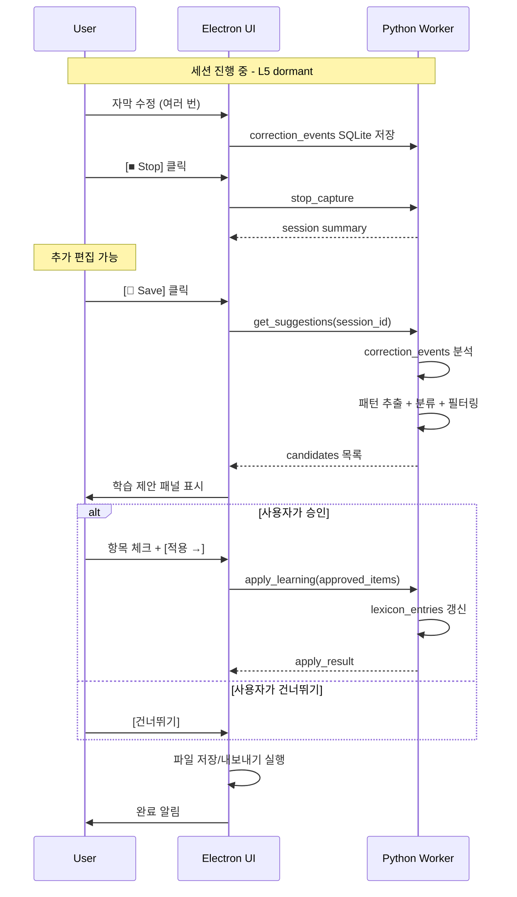

# L5 — Lexicon Learning Layer

> **상위 문서**: [00-overview.md](./00-overview.md)
> **의존**: [04-subtitle-editor.md](./04-subtitle-editor.md) (L4 → L5 전환)
> **버전**: 0.1.0-draft
> **상태**: 초안

---

## 1. 책임 정의

Lexicon Learning Layer는 **사용자의 수정 기록을 분석하여 용어집 학습 후보를 생성하고, 세션 종료 시 사용자 승인을 받아 로컬 용어집을 갱신**하는 것이 책임이다.

### 이 레이어가 하는 것

- `correction_events`를 분석하여 패턴 추출
- 각 패턴을 용어집 유형(alias, misrecognition, normalization, hotword)으로 분류
- 세션 종료 시 학습 제안 패널 표시
- 사용자 승인에 따라 로컬 용어집(`lexicon_entries`) 갱신
- 기존 항목과의 중복 검사, 가중치 갱신

### 이 레이어가 하지 않는 것

- 수정 중 팝업/추천 표시 → **금지** (핵심 UX 원칙)
- STT 모델 재학습 → 스코프 외
- 공유 용어집 업로드 → L6 책임 (V2)
- 자막 편집 UI → L4 책임

### 핵심 UX 원칙

> **세션 종료 후, 저장/내보내기 직전에 단 한 번만 학습 제안을 표시한다.**
>
> 사용자가 거절하면 즉시 저장으로 넘어간다. 강제하지 않는다.

---

## 2. 작동 시점

```text
[세션 진행 중]
  L4에서 사용자가 자막 수정
  correction_events가 SQLite에 축적
  L5는 아무것도 하지 않음 (dormant)

[세션 종료 후, Save/Export 클릭 시]
  ┌─────────────────────────────────────────┐
  │         L5 활성화 시점                    │
  │                                          │
  │  1. correction_events 일괄 분석           │
  │  2. 학습 후보 생성                        │
  │  3. 학습 제안 패널 표시                    │
  │  4. 사용자 승인/거절                      │
  │  5. 승인된 항목 → lexicon_entries 갱신     │
  │  6. → 파일 저장/내보내기 실행              │
  └─────────────────────────────────────────┘
```

---

## 3. 수정 분석 알고리즘

### 3.1 입력 데이터

```sql
-- 현재 세션의 모든 활성 수정 기록
SELECT
    ce.original_text,
    ce.corrected_text,
    ss.raw_text,
    ss.processed_text,
    ss.final_text
FROM correction_events ce
JOIN subtitle_segments ss ON ce.segment_id = ss.segment_id
WHERE ss.session_id = :current_session
  AND ce.is_active = 1
ORDER BY ce.created_at;
```

### 3.2 분석 파이프라인

```text
correction_events
    │
    ↓
┌──────────────┐     ┌──────────────┐     ┌──────────────┐
│   Diff       │────→│  Pattern     │────→│  Classify    │
│  Extraction  │     │  Grouping    │     │  & Score     │
└──────────────┘     └──────────────┘     └──────────────┘
    │                     │                     │
    │ 단어/구문 수준      │ 동일 패턴           │ 유형 분류
    │ 변경점 추출         │ 빈도 집계           │ + 신뢰도
    ↓                     ↓                     ↓
                                         학습 후보 목록
```

### 3.3 Step 1: Diff Extraction

사용자의 수정 전후 텍스트에서 **변경된 부분**을 추출한다.

```python
from difflib import SequenceMatcher

def extract_diffs(original: str, corrected: str) -> list[DiffItem]:
    """수정 전후 텍스트에서 변경된 부분을 추출한다."""
    matcher = SequenceMatcher(None, original.split(), corrected.split())
    diffs = []
    for op, i1, i2, j1, j2 in matcher.get_opcodes():
        if op == "replace":
            diffs.append(DiffItem(
                diff_type="replace",
                original=" ".join(original.split()[i1:i2]),
                corrected=" ".join(corrected.split()[j1:j2]),
            ))
        elif op == "delete":
            diffs.append(DiffItem(
                diff_type="delete",
                original=" ".join(original.split()[i1:i2]),
                corrected="",
            ))
        elif op == "insert":
            diffs.append(DiffItem(
                diff_type="insert",
                original="",
                corrected=" ".join(corrected.split()[j1:j2]),
            ))
    return diffs

@dataclass
class DiffItem:
    diff_type: Literal["replace", "delete", "insert"]
    original: str
    corrected: str
```

### 3.4 Step 2: Pattern Grouping

동일한 `(original → corrected)` 패턴이 여러 segment에서 반복되면 하나로 묶고 빈도를 집계한다.

```python
def group_patterns(all_diffs: list[DiffItem]) -> list[PatternGroup]:
    """동일 패턴을 묶고 빈도를 집계한다."""
    counter: dict[tuple[str, str], int] = {}
    for diff in all_diffs:
        if diff.diff_type == "replace":
            key = (diff.original.lower(), diff.corrected)
            counter[key] = counter.get(key, 0) + 1

    return [
        PatternGroup(original=orig, corrected=corr, frequency=freq)
        for (orig, corr), freq in counter.items()
    ]

@dataclass
class PatternGroup:
    original: str
    corrected: str
    frequency: int      # 세션 내 등장 횟수
```

### 3.5 Step 3: Classify & Score

각 패턴을 용어집 유형으로 분류하고 신뢰도를 산정한다.

```python
def classify_pattern(pattern: PatternGroup) -> LearningCandidate:
    """패턴을 용어집 유형으로 분류한다."""
    orig = pattern.original
    corr = pattern.corrected

    # 대소문자만 다른 경우 → normalization
    if orig.lower() == corr.lower() and orig != corr:
        return LearningCandidate(
            type="normalization",
            source=orig,
            target=corr,
            confidence=_compute_confidence(pattern),
        )

    # 음운 유사도가 높은 경우 → misrecognition
    if _phonetic_similarity(orig, corr) > 0.7:
        return LearningCandidate(
            type="misrecognition",
            source=orig,
            target=corr,
            confidence=_compute_confidence(pattern),
        )

    # 그 외 → alias (다른 표현)
    return LearningCandidate(
        type="alias",
        source=orig,
        target=corr,
        confidence=_compute_confidence(pattern),
    )
```

#### 음운 유사도 판별

```python
def _phonetic_similarity(a: str, b: str) -> float:
    """두 문자열의 음운 유사도를 0.0~1.0으로 반환한다.

    V1: 편집 거리 기반 단순 비율.
    V1.5: 한국어 자모 분리 후 비교 (더 정확).
    """
    from difflib import SequenceMatcher
    return SequenceMatcher(None, a, b).ratio()
```

#### 신뢰도 산정

```python
def _compute_confidence(pattern: PatternGroup) -> float:
    """패턴의 학습 신뢰도를 산정한다.

    기준:
    - 빈도 1회: 0.3 (단발성, 실험적 수정일 수 있음)
    - 빈도 2회: 0.6
    - 빈도 3회+: 0.9
    - 검색/치환(모두 치환)으로 발생: +0.1 (의도적 일괄 수정)
    """
    base = min(0.3 * pattern.frequency, 0.9)
    return min(base, 1.0)
```

---

## 4. 학습 후보 필터링

모든 패턴이 학습 제안으로 표시되지는 않는다.

### 4.1 제외 조건

| 조건 | 사유 |
|------|------|
| `confidence < 0.3` | 단발성 수정은 노이즈일 가능성 |
| 이미 로컬 용어집에 동일 항목 존재 | 중복 제안 방지 |
| `original`이 1글자 | 너무 짧은 매칭은 오탐 위험 |
| `original == corrected` | 변경 없음 |
| `original` 또는 `corrected`가 순수 공백/구두점 | 의미 없는 수정 |

### 4.2 기존 항목과의 관계

| 상황 | 처리 |
|------|------|
| 동일 `(type, source)` 항목이 없음 | 신규 제안 |
| 동일 `(type, source)` 항목이 있고 `target`도 같음 | 제안 생략 (이미 학습됨) |
| 동일 `(type, source)` 항목이 있지만 `target`이 다름 | "기존 항목 수정" 제안으로 표시 |

---

## 5. 학습 제안 패널 UI

### 5.1 패널 레이아웃

```text
┌─────────────────────────────────────────────────────────┐
│  학습 제안                                      [×]      │
│                                                          │
│  이번 세션에서 3개의 용어를 학습할 수 있습니다.            │
│                                                          │
│  ┌─────────────────────────────────────────────────────┐ │
│  │ ☑  벽강 → 벽꽝                                      │ │
│  │    유형: 오인식 교정  │  빈도: 3회  │  신뢰도: ●●●○   │ │
│  ├─────────────────────────────────────────────────────┤ │
│  │ ☑  카힛 → CH                                        │ │
│  │    유형: 별칭         │  빈도: 2회  │  신뢰도: ●●○○   │ │
│  ├─────────────────────────────────────────────────────┤ │
│  │ ☐  풍신궐 → 풍신권                                   │ │
│  │    유형: 오인식 교정  │  빈도: 1회  │  신뢰도: ●○○○   │ │
│  └─────────────────────────────────────────────────────┘ │
│                                                          │
│  ☐ 선택된 용어를 Whisper 힌트에도 추가 (hotword)          │
│                                                          │
│  [모두 선택]  [모두 해제]          [건너뛰기]  [적용 →]   │
│                                                          │
└─────────────────────────────────────────────────────────┘
```

### 5.2 사용자 인터랙션

| 요소 | 동작 |
|------|------|
| **체크박스** | 개별 항목 승인/거절 토글 |
| **모두 선택** | 전체 항목 체크 |
| **모두 해제** | 전체 항목 체크 해제 |
| **건너뛰기** | 아무것도 학습하지 않고 저장으로 진행 |
| **적용 →** | 체크된 항목만 로컬 용어집에 반영 후 저장 |
| **hotword 체크** | 체크 시, 승인된 항목의 `target`을 `type=hotword`로도 추가 |
| **유형 표시** | 사용자에게 분류를 보여주지만 변경은 불가 (V1) |

### 5.3 UX 특성

| 원칙 | 구현 |
|------|------|
| 승인은 한 번에 | 체크 후 "적용" 클릭으로 일괄 처리 |
| 개별 편집 금지 (V1) | source/target을 직접 수정하는 기능은 V1.5 |
| 기본값: 빈도 2+ 항목 체크됨 | 고신뢰 항목은 기본 선택, 저신뢰는 미선택 |
| 패널 스킵 가능 | "건너뛰기"로 학습 없이 저장 가능 |

---

## 6. 용어집 갱신

### 6.1 갱신 로직

```python
def apply_learning(
    candidates: list[LearningCandidate],
    db: LexiconStore,
    game_id: str,
) -> ApplyResult:
    """승인된 학습 후보를 로컬 용어집에 반영한다."""
    added = 0
    updated = 0

    for candidate in candidates:
        existing = db.find_entry(
            game_id=game_id,
            type=candidate.type,
            source=candidate.source,
            scope="local",
        )

        if existing is None:
            # 신규 항목 추가
            db.insert_entry(LexiconEntry(
                entry_id=generate_uuid(),
                game_id=game_id,
                type=candidate.type,
                source=candidate.source,
                target=candidate.target,
                weight=candidate.confidence,
                scope="local",
                enabled=True,
                created_at=now(),
                updated_at=now(),
            ))
            added += 1

        elif existing.target != candidate.target:
            # 기존 항목의 target이 다름 → 갱신
            db.update_entry(
                entry_id=existing.entry_id,
                target=candidate.target,
                weight=max(existing.weight, candidate.confidence),
                updated_at=now(),
            )
            updated += 1

        else:
            # 이미 동일 항목 존재 → 가중치만 갱신
            new_weight = min(existing.weight + 0.1, 1.0)
            db.update_entry(
                entry_id=existing.entry_id,
                weight=new_weight,
                updated_at=now(),
            )
            updated += 1

    return ApplyResult(added=added, updated=updated)
```

### 6.2 Hotword 자동 추가

사용자가 "Whisper 힌트에도 추가" 옵션을 체크하면, 승인된 항목의 `target`을 `type=hotword`로도 추가한다.

```python
def add_hotwords(candidates: list[LearningCandidate], db: LexiconStore, game_id: str):
    """승인된 항목의 target을 hotword로 추가한다."""
    targets = {c.target for c in candidates}
    for target in targets:
        existing = db.find_entry(
            game_id=game_id, type="hotword", source=target, scope="local"
        )
        if existing is None:
            db.insert_entry(LexiconEntry(
                entry_id=generate_uuid(),
                game_id=game_id,
                type="hotword",
                source=target,
                target=target,
                weight=1.0,
                scope="local",
                enabled=True,
                created_at=now(),
                updated_at=now(),
            ))
```

### 6.3 가중치(weight) 설계

| 수치 | 의미 |
|------|------|
| `0.0 ~ 0.3` | 약한 신뢰. 1회 발생, 실험적 |
| `0.4 ~ 0.6` | 중간 신뢰. 2회 발생, 아마 의도적 |
| `0.7 ~ 1.0` | 높은 신뢰. 3회+ 또는 일괄 치환 |

가중치는 현재 L3 후처리에서 직접 사용하지 않지만 (모든 enabled 항목이 동등하게 적용), **향후 충돌 해결이나 V2 공유 용어집 신뢰도 산정**에 활용한다.

---

## 7. 데이터 구조

### 7.1 학습 후보

```python
@dataclass
class LearningCandidate:
    """학습 제안 패널에 표시되는 후보 하나."""
    type: Literal["alias", "normalization", "misrecognition"]
    source: str                 # 원래 텍스트
    target: str                 # 교정된 텍스트
    confidence: float           # 0.0 ~ 1.0
    frequency: int              # 세션 내 발생 횟수
    is_existing_update: bool    # True면 기존 항목 수정 제안
    existing_target: str | None # 기존 항목이 있을 때의 현재 target
```

### 7.2 적용 결과

```python
@dataclass
class ApplyResult:
    """학습 적용 결과."""
    added: int          # 신규 추가된 항목 수
    updated: int        # 갱신된 항목 수
```

### 7.3 세션 학습 요약 (DB 저장)

```sql
CREATE TABLE learning_sessions (
    learning_id TEXT PRIMARY KEY,
    session_id TEXT NOT NULL REFERENCES sessions(session_id),
    total_candidates INTEGER NOT NULL,      -- 제안된 총 후보 수
    approved_count INTEGER NOT NULL,        -- 사용자가 승인한 수
    skipped BOOLEAN NOT NULL DEFAULT 0,     -- 건너뛰기 여부
    created_at TEXT NOT NULL
);

CREATE TABLE learning_items (
    item_id TEXT PRIMARY KEY,
    learning_id TEXT NOT NULL REFERENCES learning_sessions(learning_id),
    entry_id TEXT REFERENCES lexicon_entries(entry_id),  -- 반영된 용어집 항목
    type TEXT NOT NULL,
    source TEXT NOT NULL,
    target TEXT NOT NULL,
    confidence REAL NOT NULL,
    approved BOOLEAN NOT NULL,              -- 사용자가 승인했는지
    created_at TEXT NOT NULL
);
```

학습 이력을 저장하면:
- 어떤 용어가 언제 학습되었는지 추적 가능
- V2 공유 용어집 기여 시 근거 데이터로 활용
- 학습 품질 분석 (승인률, 항목당 세션 수 등)

---

## 8. IPC 메서드 (L5 관련)

### 8.1 Electron → Python

#### `get_suggestions`

세션 종료 후, 학습 후보 목록을 요청한다.

```json
{
  "jsonrpc": "2.0",
  "id": 5,
  "method": "get_suggestions",
  "params": {
    "session_id": "sess_abc123"
  }
}
```

```json
{
  "jsonrpc": "2.0",
  "id": 5,
  "result": {
    "candidates": [
      {
        "type": "misrecognition",
        "source": "벽강",
        "target": "벽꽝",
        "confidence": 0.9,
        "frequency": 3,
        "is_existing_update": false,
        "existing_target": null
      },
      {
        "type": "alias",
        "source": "카힛",
        "target": "CH",
        "confidence": 0.6,
        "frequency": 2,
        "is_existing_update": false,
        "existing_target": null
      },
      {
        "type": "misrecognition",
        "source": "풍신궐",
        "target": "풍신권",
        "confidence": 0.3,
        "frequency": 1,
        "is_existing_update": false,
        "existing_target": null
      }
    ],
    "total_corrections": 12,
    "unique_patterns": 5,
    "filtered_count": 2
  }
}
```

#### `apply_learning`

사용자가 승인한 항목을 용어집에 반영한다.

```json
{
  "jsonrpc": "2.0",
  "id": 6,
  "method": "apply_learning",
  "params": {
    "session_id": "sess_abc123",
    "approved_items": [
      {"source": "벽강", "target": "벽꽝", "type": "misrecognition"},
      {"source": "카힛", "target": "CH", "type": "alias"}
    ],
    "add_hotwords": true
  }
}
```

```json
{
  "jsonrpc": "2.0",
  "id": 6,
  "result": {
    "added": 2,
    "updated": 0,
    "hotwords_added": 2
  }
}
```

---

## 9. 전체 흐름 시퀀스



---

## 10. 다음 세션에 미치는 영향

L5에서 승인된 항목은 다음 세션부터 자동으로 효력을 발휘한다.

```text
세션 N: 사용자가 "벽강→벽꽝" 승인
    ↓ lexicon_entries에 저장
세션 N+1 시작:
    ↓ L3 LexiconCache 로드 시 새 항목 포함
    ↓ L3 Stage 2 (Misrecognition)에서 "벽강→벽꽝" 자동 교정
    ↓ L2 initial_prompt에 "벽꽝" hotword 포함 (승인 시)
```

| 영향받는 레이어 | 변화 |
|----------------|------|
| **L2 (STT Runtime)** | hotword가 추가되면 `initial_prompt`에 반영 → 인식률 향상 |
| **L3 (Post-processing)** | 새 항목이 해당 Stage에 로드되어 자동 교정 적용 |
| **L4 (Editor)** | 교정 빈도가 올라감 → 사용자 수정 횟수 감소 |

---

## 11. 에러 처리

| 에러 | 심각도 | 대응 |
|------|--------|------|
| correction_events가 0개 | 정상 | "이번 세션에서는 학습할 항목이 없습니다" 표시 후 바로 저장 |
| 분석 중 예외 | `warning` | 학습 제안 스킵, 저장은 정상 진행 |
| DB 쓰기 실패 | `error` | 사용자에게 "용어집 저장 실패" 안내, 재시도 옵션 |
| 용어집 항목 충돌 (제약 조건 위반) | `warning` | 해당 항목 스킵, 나머지 계속 |

**원칙**: 학습 실패가 저장/내보내기를 방해해서는 안 된다. 최악의 경우 학습 없이 저장만 진행한다.

---

## 12. 테스트 전략

### 12.1 단위 테스트

| 대상 | 테스트 내용 | 케이스 수 |
|------|------------|----------|
| `extract_diffs()` | replace/delete/insert 추출 정확도 | 5+ |
| `group_patterns()` | 동일 패턴 빈도 집계, 대소문자 무시 | 4+ |
| `classify_pattern()` | normalization/misrecognition/alias 분류 | 6+ |
| `_compute_confidence()` | 빈도별 점수, 상한 검증 | 4+ |
| `_phonetic_similarity()` | 음운 유사도 수치 검증 | 5+ |
| 필터링 | 제외 조건 (1글자, 중복, 저신뢰) | 5+ |
| `apply_learning()` | 신규 추가, 기존 갱신, 중복 스킵 | 4+ |
| `add_hotwords()` | hotword 추가, 중복 방지 | 3+ |

### 12.2 통합 테스트

| 시나리오 | 검증 |
|----------|------|
| 수정 5개 → 분석 → 패턴 3개 생성 | 중복 제거, 빈도 정확 |
| "모두 치환" 수정 → 고신뢰 후보 | confidence ≥ 0.6 |
| 승인 2개, 거절 1개 → 용어집 확인 | added=2, 거절 항목 미반영 |
| 다음 세션에서 승인 항목 자동 교정 | L3 정상 적용 |
| 건너뛰기 → 저장 | 용어집 변경 없음, 파일 내보내기 정상 |

### 12.3 수동 검증

| 항목 | 방법 |
|------|------|
| 학습 패널 UX | 5개 수정 후 학습 패널 확인, 체크/해제/건너뛰기 |
| 가중치 누적 | 3세션 반복하여 같은 패턴 승인 → weight 증가 확인 |
| hotword 효과 | 승인 후 다음 세션에서 해당 용어 인식률 변화 체감 |

---

## 13. 파일 구조

```text
src/
├── stt_worker/
│   └── learning/
│       ├── __init__.py
│       ├── analyzer.py       # extract_diffs, group_patterns, classify
│       ├── filter.py         # 후보 필터링 로직
│       ├── applier.py        # apply_learning, add_hotwords
│       ├── types.py          # DiffItem, PatternGroup, LearningCandidate
│       └── tests/
│           ├── test_analyzer.py
│           ├── test_filter.py
│           └── test_applier.py
│
└── renderer/
    └── components/
        └── learning/
            ├── LearningPanel.tsx       # 학습 제안 패널
            ├── CandidateRow.tsx        # 개별 후보 행
            ├── LearningControls.tsx    # 모두 선택/해제, 적용/건너뛰기
            └── __tests__/
                ├── LearningPanel.test.tsx
                └── CandidateRow.test.tsx
```

---

## 14. 미결 사항 및 후속 결정

| 항목 | 현재 상태 | 결정 시점 |
|------|----------|----------|
| 한국어 자모 분리 기반 음운 유사도 | V1은 `SequenceMatcher`, 한글 특화는 V1.5 | V1.5 |
| 사용자가 제안 항목의 source/target 직접 편집 | V1 불가. 승인/거절만 | V1.5 |
| 거절된 항목의 재제안 방지 | V1 미구현 (매 세션 독립). 거절 이력 참조는 V1.5 | V1.5 |
| 용어집 관리 UI (전체 조회, 삭제, 비활성화) | V1 미구현. 학습 패널에서만 추가 | V1.5 설정 UI |
| V2 공유 기여 큐 적재 | L6 문서에서 정의 | V2 scope (shared-sync.md) |
| `weight` 값의 L3 후처리 반영 | V1은 미사용 (enabled만 확인) | 충돌 해결 필요 시 |
