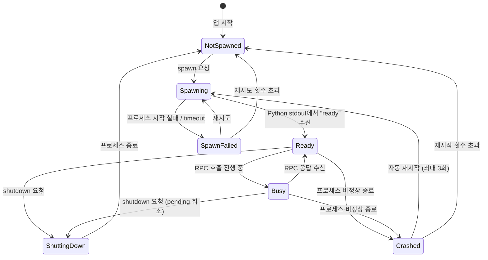
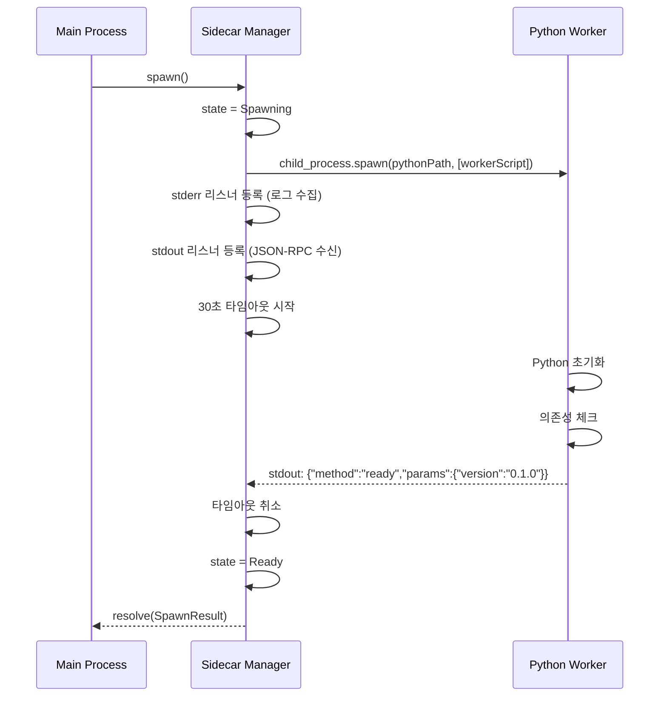
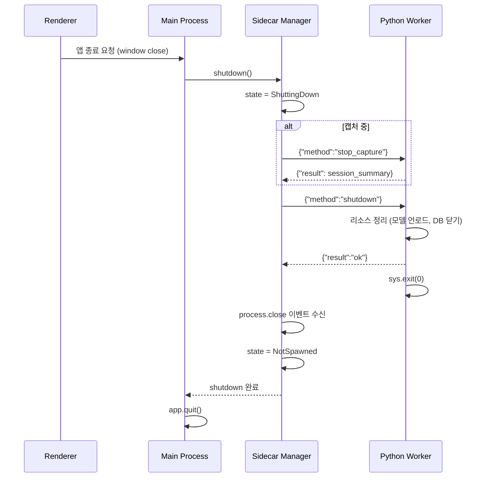

# Cross-Cutting — Sidecar Manager

> **상위 문서**: [00-overview.md](./00-overview.md)
> **관련**: 모든 레이어(L1~L5)가 이 모듈을 통해 연결됨
> **버전**: 0.1.0-draft
> **상태**: 초안

---

## 1. 책임 정의

Sidecar Manager는 **Electron Main Process에서 Python STT Worker 프로세스의 전체 생명주기를 관리하고, 양방향 JSON-RPC 통신을 중계**하는 것이 책임이다.

### 이 모듈이 하는 것

- Python sidecar 프로세스의 spawn / shutdown / crash 복구
- stdio 기반 JSON-RPC 2.0 메시지 송수신
- 요청-응답 매핑 (id 기반)
- Python → Electron 방향의 notification 라우팅
- 프로세스 health check
- 로그 수집 (Python stderr → 파일)

### 이 모듈이 하지 않는 것

- STT 추론 로직 → Python Worker 내부
- React UI 렌더링 → Renderer Process
- Electron IPC (Main ↔ Renderer) → Electron 표준 API

### 위치

```text
Electron Renderer (React UI)
        │
        │ Electron IPC (contextBridge)
        ↓
Electron Main Process
  ┌─────────────────────┐
  │   Sidecar Manager   │  ←── 이 문서의 범위
  └──────────┬──────────┘
             │ stdio (stdin/stdout/stderr)
             ↓
  Python STT Worker Process (L1~L5 로직)
```

---

## 2. 프로세스 생명주기

### 2.1 상태 머신



### 2.2 상태별 동작

| 상태 | 프로세스 | RPC 호출 가능 | 설명 |
|------|---------|-------------|------|
| `NotSpawned` | 없음 | ✗ | 초기 상태 또는 종료 후 |
| `Spawning` | 시작 중 | ✗ | Python 프로세스가 모델 로드 등 초기화 중 |
| `Ready` | 실행 중 | ✓ | 명령 수신 가능 |
| `Busy` | 실행 중 | ✓ (큐잉) | RPC 처리 중이나 추가 호출 큐잉 가능 |
| `ShuttingDown` | 종료 중 | ✗ | graceful shutdown 대기 |
| `Crashed` | 종료됨 | ✗ | 비정상 종료, 자동 재시작 시도 |
| `SpawnFailed` | 없음 | ✗ | 시작 자체가 실패 |

---

## 3. Spawn 전략

### 3.1 Python 실행 경로

| 환경 | Python 경로 | 설명 |
|------|-----------|------|
| **개발 (dev)** | 시스템 Python 또는 venv | `process.env.PYTHON_PATH` 또는 `python` |
| **프로덕션 (packaged)** | 번들된 embedded Python | `resources/python/python.exe` |

```typescript
function getPythonPath(): string {
  if (isDev()) {
    return process.env.PYTHON_PATH ?? "python";
  }
  return path.join(process.resourcesPath, "python", "python.exe");
}

function getWorkerScript(): string {
  if (isDev()) {
    return path.join(__dirname, "..", "stt_worker", "main.py");
  }
  return path.join(process.resourcesPath, "stt_worker", "main.py");
}
```

### 3.2 Spawn 시퀀스



### 3.3 Spawn 실패 처리

| 실패 원인 | 감지 방법 | 대응 |
|----------|----------|------|
| Python 실행 파일 없음 | `ENOENT` 에러 | 사용자에게 "Python 설치 확인" 안내 (dev만) |
| 의존성 누락 (`ImportError`) | stderr 출력 파싱 | 에러 메시지 포함하여 사용자 안내 |
| CUDA 초기화 실패 | stderr 또는 ready에 fallback 정보 | CPU fallback 자동 시도 |
| 30초 내 `ready` 미수신 | 타임아웃 | 프로세스 kill + 재시도 |
| 프로세스 즉시 종료 (exit code ≠ 0) | `close` 이벤트 | 에러 로그 표시 + 재시도 |

**재시도 정책**: 최대 3회, 각 시도 사이에 2초 대기. 3회 모두 실패하면 사용자에게 에러 화면 표시.

---

## 4. JSON-RPC 2.0 프로토콜

### 4.1 메시지 프레이밍

stdio는 스트림이므로, 메시지 경계를 식별해야 한다.

| 방식 | 채택 | 근거 |
|------|------|------|
| **개행 구분 JSON (NDJSON)** | ✓ | 구현 단순, 디버깅 용이 |
| Content-Length 헤더 (LSP 방식) | ✗ | 구현 복잡도 증가, 이점 없음 |

**규칙**: 각 JSON-RPC 메시지는 **한 줄의 JSON**으로 전송하고, `\n`으로 종료한다. 메시지 내부에는 줄바꿈을 포함하지 않는다.

```text
→ {"jsonrpc":"2.0","id":1,"method":"initialize","params":{...}}\n
← {"jsonrpc":"2.0","id":1,"result":{...}}\n
← {"jsonrpc":"2.0","method":"partial_result","params":{...}}\n
```

### 4.2 메시지 유형

| 유형 | 방향 | `id` 존재 | 설명 |
|------|------|----------|------|
| **Request** | E→P | ✓ | 응답을 기대하는 호출 |
| **Response** | P→E | ✓ (요청 id 매칭) | 요청에 대한 응답 |
| **Notification** | P→E | ✗ | 비요청 알림 (partial, audio_level 등) |
| **Error Response** | P→E | ✓ | 요청 처리 실패 |

### 4.3 에러 코드

| 코드 | 의미 | 사용 예 |
|------|------|---------|
| `-32700` | Parse error | 잘못된 JSON |
| `-32600` | Invalid request | 필수 필드 누락 |
| `-32601` | Method not found | 알 수 없는 메서드 |
| `-32602` | Invalid params | 파라미터 타입 오류 |
| `-32603` | Internal error | Python 내부 예외 |
| `-32000` | Device error | 오디오 장치 에러 (L1) |
| `-32001` | Model error | 모델 로드/추론 에러 (L2) |
| `-32002` | DB error | SQLite 에러 (L5) |

---

## 5. Sidecar Manager 구현

### 5.1 클래스 구조

```typescript
import { ChildProcess, spawn } from "child_process";
import { EventEmitter } from "events";

type SidecarState =
  | "not_spawned"
  | "spawning"
  | "ready"
  | "busy"
  | "shutting_down"
  | "crashed"
  | "spawn_failed";

interface PendingRequest {
  id: number;
  method: string;
  resolve: (result: unknown) => void;
  reject: (error: Error) => void;
  timer: NodeJS.Timeout;
}

class SidecarManager extends EventEmitter {
  private process: ChildProcess | null = null;
  private state: SidecarState = "not_spawned";
  private pendingRequests: Map<number, PendingRequest> = new Map();
  private nextId: number = 1;
  private restartCount: number = 0;
  private lineBuffer: string = "";

  static readonly MAX_RESTARTS = 3;
  static readonly SPAWN_TIMEOUT_MS = 30_000;
  static readonly REQUEST_TIMEOUT_MS = 60_000;
  static readonly RESTART_DELAY_MS = 2_000;
}
```

### 5.2 Spawn

```typescript
async spawn(): Promise<void> {
  if (this.state !== "not_spawned" && this.state !== "spawn_failed") {
    throw new Error(`Cannot spawn from state: ${this.state}`);
  }

  this.state = "spawning";
  const pythonPath = getPythonPath();
  const workerScript = getWorkerScript();

  this.process = spawn(pythonPath, ["-u", workerScript], {
    stdio: ["pipe", "pipe", "pipe"],
    env: { ...process.env, PYTHONUNBUFFERED: "1" },
  });

  // stderr → 로그 파일
  this.process.stderr?.on("data", (data: Buffer) => {
    this.logToFile(data.toString());
  });

  // stdout → JSON-RPC 메시지 파싱
  this.process.stdout?.on("data", (data: Buffer) => {
    this.handleStdoutData(data);
  });

  // 프로세스 종료 감지
  this.process.on("close", (code, signal) => {
    this.handleProcessExit(code, signal);
  });

  // ready 대기
  await this.waitForReady(SidecarManager.SPAWN_TIMEOUT_MS);
  this.state = "ready";
  this.restartCount = 0;
}
```

### 5.3 메시지 파싱 (NDJSON)

```typescript
private handleStdoutData(data: Buffer): void {
  this.lineBuffer += data.toString();
  const lines = this.lineBuffer.split("\n");

  // 마지막 요소는 불완전할 수 있으므로 버퍼에 유지
  this.lineBuffer = lines.pop() ?? "";

  for (const line of lines) {
    const trimmed = line.trim();
    if (!trimmed) continue;
    try {
      const message = JSON.parse(trimmed);
      this.handleMessage(message);
    } catch (e) {
      this.logToFile(`[PARSE_ERROR] ${trimmed}`);
    }
  }
}
```

### 5.4 메시지 라우팅

```typescript
private handleMessage(message: JsonRpcMessage): void {
  if ("id" in message && "result" in message) {
    // Response → pending request 해결
    this.handleResponse(message);
  } else if ("id" in message && "error" in message) {
    // Error response → pending request 거절
    this.handleErrorResponse(message);
  } else if ("method" in message && !("id" in message)) {
    // Notification → 이벤트 발행
    this.handleNotification(message);
  }
}

private handleResponse(message: JsonRpcResponse): void {
  const pending = this.pendingRequests.get(message.id);
  if (pending) {
    clearTimeout(pending.timer);
    this.pendingRequests.delete(message.id);
    pending.resolve(message.result);
  }
}

private handleNotification(message: JsonRpcNotification): void {
  // 각 notification을 EventEmitter 이벤트로 발행
  // Electron Main에서 이 이벤트를 구독하여 Renderer에 전달
  this.emit(message.method, message.params);
}
```

### 5.5 RPC 호출

```typescript
async invoke(method: string, params?: Record<string, unknown>): Promise<unknown> {
  if (this.state !== "ready" && this.state !== "busy") {
    throw new Error(`Cannot invoke from state: ${this.state}`);
  }

  const id = this.nextId++;
  const request: JsonRpcRequest = {
    jsonrpc: "2.0",
    id,
    method,
    params: params ?? {},
  };

  return new Promise((resolve, reject) => {
    const timer = setTimeout(() => {
      this.pendingRequests.delete(id);
      reject(new Error(`RPC timeout: ${method} (id=${id})`));
    }, SidecarManager.REQUEST_TIMEOUT_MS);

    this.pendingRequests.set(id, { id, method, resolve, reject, timer });

    const line = JSON.stringify(request) + "\n";
    this.process?.stdin?.write(line);
  });
}
```

---

## 6. Crash 복구

### 6.1 감지

```typescript
private handleProcessExit(code: number | null, signal: string | null): void {
  // 모든 pending request 거절
  for (const [id, pending] of this.pendingRequests) {
    clearTimeout(pending.timer);
    pending.reject(new Error(`Process exited: code=${code}, signal=${signal}`));
  }
  this.pendingRequests.clear();
  this.process = null;

  if (this.state === "shutting_down") {
    // 정상 종료
    this.state = "not_spawned";
    this.emit("shutdown_complete");
    return;
  }

  // 비정상 종료
  this.state = "crashed";
  this.emit("crashed", { code, signal });
  this.attemptRestart();
}
```

### 6.2 자동 재시작

```typescript
private async attemptRestart(): Promise<void> {
  if (this.restartCount >= SidecarManager.MAX_RESTARTS) {
    this.state = "not_spawned";
    this.emit("restart_failed", {
      message: `Max restarts (${SidecarManager.MAX_RESTARTS}) exceeded`,
    });
    return;
  }

  this.restartCount++;
  this.emit("restarting", { attempt: this.restartCount });

  await sleep(SidecarManager.RESTART_DELAY_MS);

  try {
    await this.spawn();
    this.emit("restarted", { attempt: this.restartCount });
  } catch (e) {
    this.state = "spawn_failed";
    this.attemptRestart(); // 재귀 재시도
  }
}
```

### 6.3 Crash 시 세션 상태 복원

| 상황 | 복원 전략 |
|------|----------|
| **Idle 상태에서 crash** | 재시작 후 `initialize` 재호출. 사용자 영향 없음 |
| **Transcribing 중 crash** | 재시작 → `initialize` → 사용자에게 "녹음 중단됨. 재시작하시겠습니까?" 안내. 이미 확정된 segment는 Renderer 메모리에 유지 |
| **Learning 중 crash** | 재시작 → `get_suggestions` 재호출. correction_events는 DB에 있으므로 손실 없음 |

**핵심**: 확정된 자막(final segments)은 **Renderer 상태에 유지**되고, correction_events는 **SQLite에 즉시 저장**되므로, Python crash 시에도 데이터 손실은 없다. 진행 중이던 partial만 손실된다.

---

## 7. Graceful Shutdown

### 7.1 시퀀스



### 7.2 강제 종료

graceful shutdown이 **10초 내 완료되지 않으면** 프로세스를 강제 종료한다.

```typescript
async shutdown(): Promise<void> {
  if (this.state === "not_spawned") return;

  this.state = "shutting_down";

  try {
    // 캡처 중이면 먼저 중지
    if (this.wasCapturing) {
      await this.invoke("stop_capture");
    }

    // shutdown 요청
    await Promise.race([
      this.invoke("shutdown"),
      sleep(10_000).then(() => { throw new Error("Shutdown timeout"); }),
    ]);
  } catch (e) {
    // 타임아웃 또는 에러 → 강제 종료
    this.process?.kill("SIGKILL");
  }

  this.process = null;
  this.state = "not_spawned";
}
```

---

## 8. Electron Main ↔ Renderer 연결

### 8.1 Preload Script

```typescript
// preload.ts
import { contextBridge, ipcRenderer } from "electron";

contextBridge.exposeInMainWorld("electronAPI", {
  // Renderer → Main → Python
  invoke: (method: string, params?: Record<string, unknown>) =>
    ipcRenderer.invoke("sidecar:invoke", method, params),

  // Main → Renderer (Python notification 전달)
  onProcessedResult: (callback: (data: ProcessedResult) => void) =>
    ipcRenderer.on("sidecar:processed_result", (_, data) => callback(data)),

  onPartialResult: (callback: (data: ProcessedResult) => void) =>
    ipcRenderer.on("sidecar:partial_result", (_, data) => callback(data)),

  onAudioLevel: (callback: (data: { level: number }) => void) =>
    ipcRenderer.on("sidecar:audio_level", (_, data) => callback(data)),

  onStatusUpdate: (callback: (data: StatusUpdate) => void) =>
    ipcRenderer.on("sidecar:status_update", (_, data) => callback(data)),

  onCaptureError: (callback: (data: CaptureError) => void) =>
    ipcRenderer.on("sidecar:capture_error", (_, data) => callback(data)),

  onSidecarState: (callback: (state: SidecarState) => void) =>
    ipcRenderer.on("sidecar:state_changed", (_, state) => callback(state)),

  // 리스너 정리
  removeAllListeners: (channel: string) =>
    ipcRenderer.removeAllListeners(channel),
});
```

### 8.2 Main Process 중계

```typescript
// main.ts
import { ipcMain, BrowserWindow } from "electron";

const sidecar = new SidecarManager();

// Renderer → Python: RPC 호출 중계
ipcMain.handle("sidecar:invoke", async (_, method: string, params?: unknown) => {
  return sidecar.invoke(method, params as Record<string, unknown>);
});

// Python → Renderer: notification 전달
function setupNotificationForwarding(win: BrowserWindow): void {
  const notifications = [
    "processed_result",
    "partial_result",
    "audio_level",
    "status_update",
    "capture_error",
  ];

  for (const event of notifications) {
    sidecar.on(event, (data: unknown) => {
      win.webContents.send(`sidecar:${event}`, data);
    });
  }

  // 상태 변경 전달
  sidecar.on("state_changed", (state: SidecarState) => {
    win.webContents.send("sidecar:state_changed", state);
  });
}
```

### 8.3 통신 경로 요약

```text
┌───────────┐     Electron IPC      ┌───────────┐     stdio JSON-RPC     ┌───────────┐
│  React    │◄──────────────────────►│  Main     │◄───────────────────────►│  Python   │
│  Renderer │  contextBridge         │  Process  │  stdin/stdout           │  Worker   │
│           │  ipcRenderer           │           │  NDJSON                 │           │
│  L4 UI    │  .invoke()             │  Sidecar  │  .write() / .on(data)  │  L1~L5    │
│           │  .on()                 │  Manager  │                        │           │
└───────────┘                        └───────────┘                        └───────────┘

요청 흐름: Renderer → ipcMain.handle → sidecar.invoke() → stdin → Python
응답 흐름: Python → stdout → sidecar.handleMessage → resolve(pending)
알림 흐름: Python → stdout → sidecar.emit(event) → webContents.send → Renderer
```

---

## 9. Python Worker 측 구현

### 9.1 메인 루프

```python
# stt_worker/main.py
import sys
import json
import logging
from stt_worker.dispatcher import Dispatcher

logger = logging.getLogger("stt_worker")

def main():
    """Python STT Worker 진입점. stdin에서 JSON-RPC를 읽고 stdout으로 응답한다."""
    logging.basicConfig(
        stream=sys.stderr,      # 로그는 stderr로 (Main Process가 파일에 기록)
        level=logging.INFO,
        format="%(asctime)s [%(levelname)s] %(name)s: %(message)s",
    )

    dispatcher = Dispatcher()

    # ready 알림
    send_notification("ready", {"version": "0.1.0"})

    for line in sys.stdin:
        line = line.strip()
        if not line:
            continue

        try:
            message = json.loads(line)
        except json.JSONDecodeError as e:
            send_error_response(None, -32700, f"Parse error: {e}")
            continue

        try:
            result = dispatcher.dispatch(message)
            if result is not None:  # notification은 응답 없음
                send_response(message.get("id"), result)
        except RpcError as e:
            send_error_response(message.get("id"), e.code, e.message)
        except Exception as e:
            logger.exception("Unhandled exception")
            send_error_response(message.get("id"), -32603, str(e))


def send_response(id: int | None, result: dict) -> None:
    msg = {"jsonrpc": "2.0", "id": id, "result": result}
    sys.stdout.write(json.dumps(msg) + "\n")
    sys.stdout.flush()

def send_notification(method: str, params: dict) -> None:
    msg = {"jsonrpc": "2.0", "method": method, "params": params}
    sys.stdout.write(json.dumps(msg) + "\n")
    sys.stdout.flush()

def send_error_response(id: int | None, code: int, message: str) -> None:
    msg = {"jsonrpc": "2.0", "id": id, "error": {"code": code, "message": message}}
    sys.stdout.write(json.dumps(msg) + "\n")
    sys.stdout.flush()
```

### 9.2 Dispatcher

```python
class Dispatcher:
    """JSON-RPC 메서드를 실제 핸들러에 라우팅한다."""

    def __init__(self):
        self._audio_capture: AudioCapture | None = None
        self._stt_runtime: STTRuntime | None = None
        self._post_processor: PostProcessor | None = None
        self._lexicon_store: LexiconStore | None = None

        self._methods: dict[str, Callable] = {
            "initialize": self._handle_initialize,
            "start_capture": self._handle_start_capture,
            "stop_capture": self._handle_stop_capture,
            "list_devices": self._handle_list_devices,
            "get_suggestions": self._handle_get_suggestions,
            "apply_learning": self._handle_apply_learning,
            "change_model": self._handle_change_model,
            "shutdown": self._handle_shutdown,
        }

    def dispatch(self, message: dict) -> dict | None:
        method = message.get("method")
        if method not in self._methods:
            raise RpcError(-32601, f"Method not found: {method}")
        return self._methods[method](message.get("params", {}))
```

### 9.3 비동기 Notification 전송

L1(audio_level), L2(partial/final), L3(processed_result)의 결과는 **추론 스레드에서 발생**하므로, stdout 쓰기는 **스레드 안전**해야 한다.

```python
import threading

class NotificationSender:
    """스레드 안전한 JSON-RPC notification 전송기."""

    def __init__(self):
        self._lock = threading.Lock()

    def send(self, method: str, params: dict) -> None:
        msg = json.dumps({"jsonrpc": "2.0", "method": method, "params": params})
        with self._lock:
            sys.stdout.write(msg + "\n")
            sys.stdout.flush()
```

---

## 10. Health Check

### 10.1 메커니즘

Sidecar Manager는 **30초마다 ping**을 보내 Python 프로세스의 생존을 확인한다.

```typescript
private healthCheckInterval: NodeJS.Timeout | null = null;

private startHealthCheck(): void {
  this.healthCheckInterval = setInterval(async () => {
    try {
      await Promise.race([
        this.invoke("ping"),
        sleep(5_000).then(() => { throw new Error("Ping timeout"); }),
      ]);
    } catch (e) {
      // 응답 없음 → crash로 간주
      this.process?.kill();
    }
  }, 30_000);
}
```

### 10.2 Python 측 Ping 핸들러

```python
def _handle_ping(self, params: dict) -> dict:
    return {
        "status": "alive",
        "uptime_sec": time.monotonic() - self._start_time,
        "state": self._current_state,
    }
```

---

## 11. 로그 관리

### 11.1 로그 경로

```text
~/.luciper/
├── logs/
│   ├── main-2026-03-29.log        # Electron Main Process 로그
│   ├── worker-2026-03-29.log      # Python Worker stderr 로그
│   └── worker-2026-03-28.log      # 이전 날짜 로그
```

### 11.2 로그 수집

```typescript
private logStream: fs.WriteStream | null = null;

private setupLogging(): void {
  const logDir = path.join(app.getPath("userData"), "logs");
  fs.mkdirSync(logDir, { recursive: true });

  const today = new Date().toISOString().split("T")[0];
  const logPath = path.join(logDir, `worker-${today}.log`);
  this.logStream = fs.createWriteStream(logPath, { flags: "a" });
}

private logToFile(data: string): void {
  const timestamp = new Date().toISOString();
  this.logStream?.write(`[${timestamp}] ${data}`);
}
```

### 11.3 로그 로테이션

| 정책 | 값 |
|------|-----|
| 로테이션 | 일 단위 (파일명에 날짜 포함) |
| 보관 기간 | 7일 |
| 최대 크기 | 50MB/파일 |

앱 시작 시 7일 이상 된 로그 파일을 삭제한다.

---

## 12. 에러 처리 요약

| 에러 | 감지 | 대응 | 사용자 영향 |
|------|------|------|------------|
| Python 미설치 (dev) | `ENOENT` | 에러 화면 + 설치 안내 | 앱 사용 불가 |
| 모듈 임포트 실패 | stderr `ImportError` | 에러 화면 + 의존성 안내 | 앱 사용 불가 |
| Spawn timeout | 30초 대기 후 kill | 재시도 3회 | 시작 지연 |
| RPC timeout | 60초 대기 | pending reject, 세션 계속 | 해당 요청 실패 |
| Python crash | `close` 이벤트 | 자동 재시작, 세션은 편집 가능 | partial 손실, final 보존 |
| Shutdown timeout | 10초 대기 | `SIGKILL` 강제 종료 | 없음 (앱 종료 중) |
| Health check 실패 | Ping timeout 5초 | 프로세스 kill + 재시작 | 일시적 중단 |

---

## 13. 테스트 전략

### 13.1 단위 테스트

| 대상 | 테스트 내용 | Mock 대상 |
|------|------------|----------|
| `handleStdoutData()` | NDJSON 파싱, 불완전 라인 버퍼링 | 없음 (순수 함수) |
| `handleMessage()` | response/notification/error 라우팅 | 없음 |
| `invoke()` | 요청 직렬화, 타임아웃, pending 관리 | `child_process` |
| 상태 전이 | 유효/무효 전이 검증 | 없음 |
| `handleProcessExit()` | pending 일괄 거절, crash 감지 | 없음 |

### 13.2 통합 테스트

| 시나리오 | 검증 |
|----------|------|
| Spawn → ready → invoke → shutdown | 전체 생명주기 정상 동작 |
| Spawn → crash → 자동 재시작 → ready | 재시작 후 정상 동작 |
| 3회 crash → restart_failed | 최대 재시작 초과 처리 |
| 동시 invoke 5개 → 순차 응답 | pending 매핑 정확도 |
| Shutdown 중 invoke → reject | 상태 기반 reject |

### 13.3 Mock Python Worker

테스트를 위해 **mock Python 스크립트**를 제공한다.

```python
# tests/mock_worker.py
"""테스트용 Mock Python Worker. RPC echo + 지연 시뮬레이션."""
import json, sys, time

sys.stdout.write(json.dumps({"jsonrpc":"2.0","method":"ready","params":{"version":"test"}}) + "\n")
sys.stdout.flush()

for line in sys.stdin:
    msg = json.loads(line.strip())
    if msg.get("method") == "ping":
        resp = {"jsonrpc":"2.0","id":msg["id"],"result":{"status":"alive"}}
    elif msg.get("method") == "shutdown":
        resp = {"jsonrpc":"2.0","id":msg["id"],"result":"ok"}
        sys.stdout.write(json.dumps(resp) + "\n")
        sys.stdout.flush()
        break
    else:
        resp = {"jsonrpc":"2.0","id":msg["id"],"result":{"echo":msg}}
    sys.stdout.write(json.dumps(resp) + "\n")
    sys.stdout.flush()
```

---

## 14. 파일 구조

```text
src/
├── main/
│   ├── main.ts                     # Electron Main 진입점
│   ├── sidecar/
│   │   ├── SidecarManager.ts       # 프로세스 관리, JSON-RPC
│   │   ├── types.ts                # SidecarState, JsonRpc 타입
│   │   └── __tests__/
│   │       ├── SidecarManager.test.ts
│   │       └── mock_worker.py
│   ├── ipc/
│   │   └── handlers.ts             # ipcMain.handle 등록
│   └── logging/
│       └── logManager.ts           # 로그 로테이션, 파일 관리
│
├── preload/
│   └── preload.ts                  # contextBridge 노출
│
└── stt_worker/
    ├── main.py                     # Python Worker 진입점
    ├── dispatcher.py               # JSON-RPC 메서드 라우팅
    ├── notification.py             # NotificationSender
    ├── audio/                      # L1
    ├── stt/                        # L2
    ├── postprocess/                # L3
    ├── learning/                   # L5
    └── db/
        ├── store.py                # SQLite 접근 레이어
        └── migrations/             # 스키마 마이그레이션
```

---

## 15. 미결 사항

| 항목 | 현재 상태 | 결정 시점 |
|------|----------|----------|
| Python 번들 크기 최적화 | 전체 venv 번들 (예상 ~200MB+) | 패키징 시 PyInstaller / 선별 복사 검토 |
| CUDA 번들링 여부 | 미정. 사용자 시스템 CUDA에 의존? 앱 번들에 포함? | 패키징 시 |
| WebSocket 대안 | stdio로 시작, 성능 이슈 시 WebSocket 전환 | V1.5 성능 측정 후 |
| 다중 Worker 지원 | V1은 단일 Worker | 성능 병목 시 |
