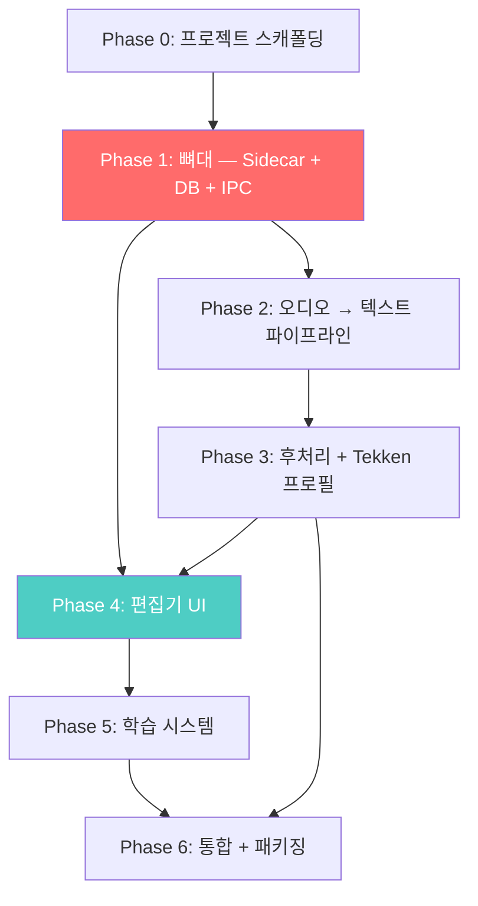

# Luciper V1 — Implementation Plan

> **버전**: 0.1.0
> **최종 수정**: 2026-03-29
> **전제**: 구현 시작 전 아키텍처 문서 확정 완료 (00~06)
> **전략**: Skeleton First — 전체 뼈대를 먼저 세우고, 각 레이어의 내부 로직을 점진적으로 채움

---

## 구현 전략

### 왜 Skeleton First인가

| 전략 | 장점 | 단점 | 채택 |
|------|------|------|------|
| Bottom-up (L1→L2→…L5) | 각 레이어를 완성하고 넘어감 | 맨 끝(L4 UI)까지 가야 결과 확인 가능 | ✗ |
| Vertical Slice (한 기능을 끝까지) | 빠른 가치 검증 | 뼈대 없이 시작하면 IPC 구조가 뒤틀림 | ✗ |
| **Skeleton First** | IPC·DB·프로세스 관리를 먼저 검증, 이후 병렬 작업 가능 | 초기에 동작하는 기능이 없음 | ✓ |

**핵심 리스크가 Electron↔Python IPC에 있으므로**, 이 연결을 먼저 확립하고 나머지를 채우는 것이 안전하다.

---

## Phase 의존성 그래프



> **Phase 1**이 가장 중요한 병목. Phase 2/3(Python 측)과 Phase 4(UI 측)는 Phase 1 완료 후 **일부 병렬 작업 가능**.

---

## Phase 0: 프로젝트 스캐폴딩

> **목표**: 빌드·실행 가능한 빈 프로젝트 구조 수립

### 작업 목록

| # | 작업 | 상세 |
|---|------|------|
| 0-1 | Electron + React + TypeScript 프로젝트 초기화 | `electron-vite` 또는 수동 구성. React 18+, TypeScript strict |
| 0-2 | Python 프로젝트 구조 생성 | `stt_worker/` 디렉토리, `requirements.txt`, `pyproject.toml` |
| 0-3 | `.gitignore` 설정 | node_modules, \_\_pycache\_\_, .env, dist, models/ |
| 0-4 | ESLint + Prettier 설정 | TypeScript strict, React rules |
| 0-5 | Python linter 설정 | ruff 또는 flake8, black formatter |
| 0-6 | 테스트 프레임워크 설치 | Jest + React Testing Library (TS), pytest (Python) |
| 0-7 | dev 모드 실행 확인 | `npm run dev`로 Electron 빈 창 표시 확인 |
| 0-8 | Python 가상환경 + 의존성 설치 | faster-whisper, sounddevice, numpy 등 |

### 산출물

```text
luciper/
├── package.json
├── tsconfig.json
├── electron.vite.config.ts
├── src/
│   ├── main/                # Electron Main
│   │   └── main.ts
│   ├── preload/
│   │   └── preload.ts
│   └── renderer/            # React UI
│       ├── App.tsx
│       └── index.html
├── stt_worker/              # Python
│   ├── main.py
│   ├── requirements.txt
│   └── pyproject.toml
├── profiles/
│   └── tekken/
├── docs/
│   └── architecture/
├── .gitignore
├── .eslintrc.json
└── .prettierrc
```

### 완료 기준

- [ ] `npm run dev` → Electron 빈 창 표시
- [ ] `python stt_worker/main.py` → stdin으로 JSON 입력하면 stdout에 응답
- [ ] `npm test` → 0 pass, 0 fail (테스트 프레임워크 동작 확인)
- [ ] `pytest` → 0 pass, 0 fail

---

## Phase 1: 뼈대 — Sidecar Manager + DB + IPC

> **목표**: Electron에서 Python 프로세스를 spawn하고, JSON-RPC로 양방향 통신이 되는 것을 검증

### 작업 목록

| # | 작업 | 참조 문서 | 난이도 |
|---|------|----------|--------|
| 1-1 | Python Worker 메인 루프 구현 | 06-sidecar-manager §9 | 중 |
| 1-2 | Python Dispatcher (ping, initialize, shutdown) | 06 §9.2 | 중 |
| 1-3 | NotificationSender (스레드 안전 stdout 쓰기) | 06 §9.3 | 하 |
| 1-4 | SidecarManager 클래스 (TypeScript) | 06 §5 | 상 |
| 1-5 | NDJSON 파싱 + 라인 버퍼링 | 06 §5.3 | 중 |
| 1-6 | 요청-응답 매핑 (pending map) | 06 §5.5 | 중 |
| 1-7 | Notification 이벤트 라우팅 | 06 §5.4 | 중 |
| 1-8 | Crash 감지 + 자동 재시작 (3회) | 06 §6 | 중 |
| 1-9 | Graceful shutdown 시퀀스 | 06 §7 | 중 |
| 1-10 | Health check (ping 30초 주기) | 06 §10 | 하 |
| 1-11 | Preload + contextBridge 설정 | 06 §8 | 하 |
| 1-12 | ipcMain.handle 등록 | 06 §8.2 | 하 |
| 1-13 | 로그 관리 (stderr → 파일) | 06 §11 | 하 |
| 1-14 | SQLite DB 초기화 + 스키마 생성 | 00 §8 | 중 |
| 1-15 | LexiconStore 기본 CRUD | 03 §4 | 중 |
| 1-16 | SidecarManager 단위 테스트 (mock_worker.py 포함) | 06 §13 | 중 |

### 완료 기준

- [ ] Electron 시작 → Python 프로세스 자동 spawn → `ready` 수신
- [ ] Renderer에서 `invoke("ping")` → Python 응답 수신 확인 표시
- [ ] Python 프로세스 수동 kill → 자동 재시작 → 정상 복구
- [ ] Electron 창 닫기 → graceful shutdown (Python 정리 종료)
- [ ] SQLite에 sessions, lexicon_entries 테이블 생성 확인
- [ ] SidecarManager 단위 테스트 통과

### 검증 방법

Renderer에 임시 디버그 패널:

```text
[Sidecar Status: Ready]  [Ping: 2ms]
[Send Test RPC]  [Kill Python]  [Restart]
[DB: 5 tables created]
```

---

## Phase 2: 오디오 → 텍스트 파이프라인 (L1 + L2)

> **목표**: 마이크 음성을 Whisper로 전사하여 Electron에 partial/final 텍스트가 도착

### 작업 목록

| # | 작업 | 참조 문서 | 난이도 |
|---|------|----------|--------|
| 2-1 | AudioCapture 클래스 (sounddevice 콜백) | 01 §8.2 | 중 |
| 2-2 | AudioBuffer 링 버퍼 구현 | 01 §4 | 중 |
| 2-3 | 장치 열거 (list_devices) | 01 §5 | 하 |
| 2-4 | 레벨 미터 계산 + audio_level 알림 | 01 §8.3 | 하 |
| 2-5 | AudioCapture 상태 머신 | 01 §6 | 중 |
| 2-6 | 모델 다운로드 + 경로 관리 (model_store) | 02 §4.1 | 중 |
| 2-7 | STTRuntime 초기화 (모델 로드, GPU/CPU 감지) | 02 §8 | 상 |
| 2-8 | Audio Consumer 스레드 (버퍼 pull + VAD) | 02 §6 | 상 |
| 2-9 | Inference 스레드 (Whisper 추론) | 02 §6 | 상 |
| 2-10 | Partial 방출 로직 (2초 주기) | 02 §5.3 | 중 |
| 2-11 | Final 방출 로직 (VAD 침묵 감지) | 02 §5.2 | 중 |
| 2-12 | Dispatcher에 start_capture/stop_capture 연결 | 06 §9.2 | 중 |
| 2-13 | status_update 알림 (모델 로딩 진행률) | 02 §11.2 | 하 |
| 2-14 | L1 + L2 단위 테스트 | 01 §10, 02 §12 | 중 |
| 2-15 | L1 + L2 통합 테스트 (실제 마이크 → 텍스트) | 02 §12.2 | 중 |

### 완료 기준

- [ ] `initialize(model_size="base", device="auto")` → 모델 로드 성공
- [ ] `start_capture()` → 마이크에 말하면 `partial_result` IPC 수신
- [ ] 침묵 감지 후 `final_result` IPC 수신, 텍스트 내용 정확
- [ ] `stop_capture()` → 세션 요약 반환
- [ ] GPU 없는 환경에서 CPU fallback 정상 동작
- [ ] 5분 연속 캡처 → 메모리 누수 없음

### 검증 방법

Renderer 디버그 패널에 추가:

```text
[Model: base | Device: cpu | Status: Ready]
[▶ Start Capture]  [■ Stop]
[Audio Level: ████░░░░ 0.42]
Partial: "지금 일렉이 깔끔하게..."
Final #1: "자 시작합니다" (00:00:03)
Final #2: "일렉이 깔끔하게 들어갔고..." (00:00:08)
```

---

## Phase 3: 후처리 + Tekken 프로필 (L3)

> **목표**: STT raw 텍스트가 철권 용어로 교정되어 L4에 도달

### 작업 목록

| # | 작업 | 참조 문서 | 난이도 |
|---|------|----------|--------|
| 3-1 | Tekken `profile.json` 작성 | 00 §7 | 하 |
| 3-2 | Tekken `rules.json` 작성 (초기 30~50항목) | 03 §9 | 중 |
| 3-3 | Tekken `lexicon_defaults.json` 생성 | 03 §9.2 | 하 |
| 3-4 | LexiconCache 구현 (우선순위 병합) | 03 §4 | 중 |
| 3-5 | NormalizationStage 구현 | 03 §3.1 | 하 |
| 3-6 | MisrecognitionStage 구현 (조사 보존) | 03 §3.2 | 상 |
| 3-7 | AliasResolutionStage 구현 (긴 패턴 우선) | 03 §3.3 | 중 |
| 3-8 | PhraseStabilizationStage 구현 | 03 §3.4 | 하 |
| 3-9 | PostProcessor 파이프라인 조립 | 03 §5 | 하 |
| 3-10 | L2 → L3 연결 (final_result → PostProcessor) | 03 §8 | 하 |
| 3-11 | processed_result IPC 메시지 발송 | 03 §10 | 하 |
| 3-12 | Initial prompt 빌드 (프로필 + hotword) | 02 §4.3 | 중 |
| 3-13 | Golden test set 작성 + 회귀 테스트 | 03 §12.2 | 중 |
| 3-14 | L3 단위 테스트 (각 Stage별) | 03 §12.1 | 중 |

### 완료 기준

- [ ] "ewgf" → "EWGF" (normalization)
- [ ] "벽강을" → "벽꽝을" (misrecognition + 조사 보존)
- [ ] "카운터 히트로 일렉" → "CH로 EWGF" (alias)
- [ ] Golden test 전체 통과
- [ ] processed_result IPC에 corrections 배열 포함
- [ ] 후처리 시간 < 5ms (500항목 기준)

---

## Phase 4: 편집기 UI (L4)

> **목표**: 사용자가 자막을 보고, 수정하고, 내보낼 수 있는 React UI

### 작업 목록

| # | 작업 | 참조 문서 | 난이도 |
|---|------|----------|--------|
| 4-1 | EditorPage 레이아웃 (Header + Live + List + Status) | 04 §2 | 중 |
| 4-2 | HeaderBar (SessionTimer, RecordingControls) | 04 §2.2 | 중 |
| 4-3 | AudioLevelMeter 컴포넌트 | 04 §8.1 | 하 |
| 4-4 | LivePreview 컴포넌트 (partial 표시) | 04 §4 | 중 |
| 4-5 | SubtitleList + SegmentRow (가상 스크롤) | 04 §3 | 상 |
| 4-6 | SegmentText 인라인 편집 | 04 §3.3 | 상 |
| 4-7 | 자동 스크롤 정책 (useAutoScroll) | 04 §4.2 | 중 |
| 4-8 | EditorContext + editorReducer 상태 관리 | 04 §9 | 중 |
| 4-9 | IPC 이벤트 리스너 연결 (useIpcListener) | 04 §10 | 중 |
| 4-10 | Correction 기록 (correction_events DB 저장) | 04 §5 | 중 |
| 4-11 | CorrectionDetail (후처리 diff 표시) | 04 §13.3 | 하 |
| 4-12 | SearchBar (검색 / 치환) | 04 §6 | 중 |
| 4-13 | 키보드 단축키 바인딩 | 04 §12 | 하 |
| 4-14 | ExportButton (SRT, TXT, JSON) | 04 §7 | 중 |
| 4-15 | StatusBar (통계) | 04 §2.2 | 하 |
| 4-16 | 다크 모드 스타일링 | 04 §13 | 중 |
| 4-17 | L4 컴포넌트 테스트 | 04 §15 | 중 |

### 완료 기준

- [ ] 실시간 녹음 → partial 표시 → final 리스트 누적
- [ ] 자막 텍스트 클릭 → 인라인 편집 → Enter 확정 → correction 저장
- [ ] Tab/Shift+Tab으로 연속 segment 편집
- [ ] Ctrl+F 검색 → 매칭 하이라이트 → 치환 동작
- [ ] SRT 내보내기 → 파일 저장 다이얼로그
- [ ] 상단 편집 중 → 하단에 새 segment 추가 → 스크롤 동결
- [ ] 300 segments에서 FPS > 30

---

## Phase 5: 학습 시스템 (L5)

> **목표**: 세션 종료 시 학습 제안 패널이 표시되고, 승인 시 로컬 용어집이 갱신됨

### 작업 목록

| # | 작업 | 참조 문서 | 난이도 |
|---|------|----------|--------|
| 5-1 | Diff Extraction (수정 전후 비교) | 05 §3.3 | 중 |
| 5-2 | Pattern Grouping (빈도 집계) | 05 §3.4 | 하 |
| 5-3 | Classify & Score (유형 분류 + 신뢰도) | 05 §3.5 | 중 |
| 5-4 | 후보 필터링 (제외 조건 적용) | 05 §4 | 하 |
| 5-5 | get_suggestions Dispatcher 연결 | 05 §8 | 하 |
| 5-6 | apply_learning 로직 (용어집 갱신) | 05 §6 | 중 |
| 5-7 | Hotword 자동 추가 | 05 §6.2 | 하 |
| 5-8 | learning_sessions / learning_items DB 저장 | 05 §7.3 | 하 |
| 5-9 | LearningPanel UI 컴포넌트 | 05 §5 | 중 |
| 5-10 | CandidateRow 컴포넌트 | 05 §5.1 | 하 |
| 5-11 | 세션 종료 → 학습 패널 표시 전환 흐름 | 05 §9 | 중 |
| 5-12 | "다음 세션" 검증: 승인 항목이 L3에 반영되는지 | 05 §10 | 중 |
| 5-13 | L5 단위 테스트 | 05 §12 | 중 |

### 완료 기준

- [ ] 세션에서 5개 수정 → Save 클릭 → 학습 패널에 3개 후보 표시
- [ ] 빈도 2+ 항목 기본 체크됨, 빈도 1 항목 미체크
- [ ] "적용" → 로컬 용어집에 항목 추가 확인
- [ ] "건너뛰기" → 용어집 변경 없이 파일 저장 진행
- [ ] 다음 세션에서 승인 항목이 L3 자동 교정에 반영됨
- [ ] hotword 체크 → 다음 세션 initial_prompt에 포함 확인

---

## Phase 6: 통합 + 패키징

> **목표**: 엔드투엔드 동작 검증, Windows installer 생성

### 작업 목록

| # | 작업 | 난이도 |
|---|------|--------|
| 6-1 | 엔드투엔드 시나리오 테스트 (녹음 → 편집 → 학습 → 다음 세션) | 상 |
| 6-2 | Python embedded 번들링 (venv 패키징) | 상 |
| 6-3 | electron-builder 설정 (Windows installer) | 상 |
| 6-4 | 첫 실행 경험 (모델 다운로드 UI, 장치 선택) | 중 |
| 6-5 | 에러 화면 (Python spawn 실패, 모델 로드 실패) | 중 |
| 6-6 | 설정 화면 (모델 크기, 오디오 장치) | 중 |
| 6-7 | README.md 작성 | 중 |
| 6-8 | 성능 벤치마크 (CPU/GPU 지연, 메모리) | 중 |
| 6-9 | 버그 수정 + 안정화 | 상 |
| 6-10 | 릴리스 빌드 + 테스트 설치 | 중 |

### 완료 기준

- [ ] 클린 Windows 10 PC에서 installer 설치 → 동작 확인
- [ ] 첫 실행: 모델 다운로드 진행률 → 완료 → 인식 가능
- [ ] GPU 없는 PC에서 CPU 모드 정상 동작
- [ ] 10분 연속 세션 → 크래시 없음
- [ ] 녹음 → 편집 → 학습 → 다음 세션에서 개선 확인 (풀 사이클)

---

## 리스크 관리

| 리스크 | 영향 | 확률 | 대응 |
|--------|------|------|------|
| **Python 번들 크기 과대 (500MB+)** | 배포 마찰 | 높음 | PyInstaller 또는 선별 복사로 최소화. 모델은 별도 다운로드 |
| **CUDA 번들링 복잡도** | GPU 모드 배포 불가 | 중간 | V1은 사용자 시스템 CUDA에 의존. 앱은 CPU fallback 보장 |
| **sounddevice 일부 마이크 미지원** | 특정 사용자 사용 불가 | 낮음 | 장치 열거 시 에러 핸들링, 대체 장치 안내 |
| **faster-whisper CPU 모드 실시간 불가** | 핵심 UX 훼손 | 중간 | tiny/base 모델 제한, partial 비활성화 |
| **한국어 조사 후처리 오류** | 부자연스러운 텍스트 | 중간 | Golden test 확충, 조사 패턴 지속 보강 |
| **Electron IPC 고빈도 메시지 병목** | UI 프레임 드롭 | 낮음 | audio_level 전송 주기 조절, 배치 처리 |

---

## 전체 작업 통계

| Phase | 작업 수 | 핵심 난이도 |
|-------|--------|-----------|
| Phase 0: 스캐폴딩 | 8 | 하 |
| Phase 1: 뼈대 | 16 | **상** (SidecarManager) |
| Phase 2: 오디오+STT | 15 | **상** (멀티스레드 추론) |
| Phase 3: 후처리 | 14 | 중 (조사 처리) |
| Phase 4: 편집기 UI | 17 | **상** (가상 스크롤 + 인라인 편집) |
| Phase 5: 학습 | 13 | 중 |
| Phase 6: 통합 | 10 | **상** (패키징) |
| **합계** | **93** | |

## Phase 0: 프로젝트 뼈대 생성 (Skeleton)

### 목표
- 각 폴더에 핵심 클래스/인터페이스 파일을 빈 껍데기 형태로 생성.

### 작업 목록
| # | 파일 경로 | 클래스/인터페이스 | 설명 |
|---|---|---|---|
| S-1 | src/main/main.ts | class MainProcess | Electron 메인 프로세스 진입점 |
| S-2 | src/preload/preload.ts | class PreloadBridge | Renderer와 Main 사이 브리지 |
| S-3 | src/renderer/App.tsx | function App | React 루트 컴포넌트 |
| S-4 | src/renderer/index.html | (HTML) | 기본 HTML 템플릿 |
| S-5 | stt_worker/main.py | class STTWorker | Python 워커 진입점 |
| S-6 | stt_worker/dispatcher.py | class Dispatcher | IPC 명령 디스패처 |
| S-7 | stt_worker/sidecar_manager.ts | class SidecarManager | TypeScript IPC 관리 클래스 |
| S-8 | stt_worker/db.ts | class DB | SQLite DB 래퍼 |
| S-9 | stt_worker/model_store.ts | class ModelStore | 모델 경로 관리 |
| S-10 | stt_worker/audio_capture.ts | class AudioCapture | 오디오 캡처 인터페이스 |

### 완료 기준
- 파일이 생성되고, 각 파일에 export된 클래스/함수 선언만 존재.
- TypeScript 파일은 `export` 문 포함, Python 파일은 `if __name__ == "__main__": pass` placeholder.

### Open Questions
- None.
